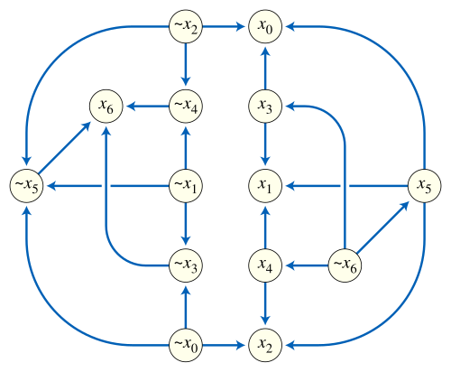

import Caption from '../../../../components/Caption.tsx';

N개의 불리언 변수에 대해 2-CNF 식을 True로 만들기 위해 각 변수값을 어떻게 정하는지를 구하는 문제라고 하는데...

일단 CNF(conjunctive normal form)는 여러 절의 AND로 이루어진 논리식이고 2- 가 붙으면 각 절에 요소가 2개 있는 것으로 보면 된다.
즉, 다음과 같은 형태의 논리식에서 각 변수의 값을 결정하는 문제로 보면 된다.

$$
C_1 \land C_2 \land \dots \land C_m
$$

아래는 변수가 3개인 2-CNF식의 표현 예시

$$
(x_1 \lor x_2) \land (\lnot x_2 \lor x_3) \land (\lnot x_1 \lor \lnot x_3)
$$


<Caption text="변수가 7개인 2-SAT 문제를 그래프로 표현한 형태"/>
<br/>

그래프로 나타낼 수 있는 문제에서 특정한 간선을 반드시 선택해야 하거나, 모두 고를 수 없는 등 제약 조건이 걸린 형태에서 활용할 수 있다.
각각의 Clause를 통해 노드간 제약을 표현하고 제약이 걸린 상태에서 목표한 값에 도달이 가능한지, 가능하다면 어떤 불리언 값을 선택해야 하는지의 문제로 치환할 수 있다.

이전에 학습했던 SCC 알고리즘을 활용하는 대표적인 문제인 것 같아서 풀어보았다. 개인적으로는 코사라주 알고리즘이 더 직관적이고 기억에 남아 
코사라주 알고리즘을 사용하였다. 

단순히 SCC를 검출하는 것에 추가로 다음의 내용을 고려하여 작성한다.
- 각각의 불리언 변수가 2가지 상태를 가지므로 2개의 노드로 취급한다.
- 절이 참이 아닐 수 있는 경우를 막기 위해 간선의 형태로 제약을 넣는다.(NA -> B, NB -> A)
- 동일한 SCC집합에 특정 노드와 노드의 Not에 해당하는 노드가 동시에 포함되면 논리식이 참이 될 수 없으므로 해당 부분을 처리한다.

직관적으로 

$$
(x_1 \lor x_1) \land (\lnot x_1 \lor \lnot x_1)
$$

와 같은 논리식은 항상 false가 됨을 알 수 있다. 이러한 식은 $x_1 $과 $\lnot x_1$이 서로를 향하는 사이클이 되며 동일한 SCC집합에 들어가게 되는 경우이다.
중간에 다른 노드를 거치더라도, 동일한 SCC집합 안에 있다면 해당 집합안의 모든 노드에 접근할 수 있으므로 동치가 된다. 이러한 케이스가 없다면 논리식이 참이 되는 경우가 존재하는 것으로 볼 수 있다.

[BOJ 11281 link](https://www.acmicpc.net/problem/11281)

```cpp
#include <bits/stdc++.h>
using namespace std;

int getNode(int n) {
    int v = abs(n) - 1; int node = 2 * v;
    if (n < 0) node ^= 1;
    return node;
}

int main() {
    ios_base::sync_with_stdio(false); cin.tie(NULL);
    int N, M; cin >> N >> M;
    int V = 2 * N;
    vector<vector<int>> graph(V), reversedGraph(V);

    for (int i = 0; i < M; ++i) {
        int a, b; cin >> a >> b;
        int A = getNode(a); int B = getNode(b);
        int NA = A ^ 1; int NB = B ^ 1;
        // 논리식 제약에 대한 그래프 형성
        graph[NA].push_back(B);
        graph[NB].push_back(A);
        reversedGraph[B].push_back(NA);
        reversedGraph[A].push_back(NB);
    }

    stack<int> st;
    vector<int> visited(V, 0);

    function<void(int)> dfs1 = [&](int v) {
        visited[v] = 1;
        for (int u : reversedGraph[v]) {
            if (!visited[u]) dfs1(u);
        }
        st.push(v);
    };

    for (int v = 0; v < V; ++v) {
        if (!visited[v]) dfs1(v);
    }

    vector<int> comp(V, -1);
    int cid = 0;

    function<void(int)> dfs2 = [&](int v) {
        comp[v] = cid;
        for (int u : graph[v]) {
            if (comp[u] == -1) dfs2(u);
        }
    };
    // SCC집합 고유 인덱스 부여
    while (!st.empty()) {
        int v = st.top(); st.pop();
        if (comp[v] == -1) {
            dfs2(v);
            ++cid;
        }
    }
    // 특정 요소와 해당 요소의 Not이 동일 집합에 속한다면 0출력(논리식이 항상 거짓)
    for (int i = 0; i < N; ++i) {
        if (comp[2 * i] == comp[2 * i + 1]) {
            cout << 0 << '\n';
            return 0;
        }
    }

    // 위상순서상 더 뒤에 있는 SCC 집합에 속한 노드를 false,
    // 그 반대 SCC 집합에 속한 노드를 true로 처리
    vector<int> ans(N);
    for (int i = 0; i < N; ++i) {
        ans[i] = (comp[2 * i] > comp[2 * i + 1]) ? 0 : 1;
    }

    cout << 1 << '\n';
    for (int i = 0; i < N; ++i) {
        cout << ans[i] << (i + 1 == N ? '\n' : ' ');
    }
}
```

<br/>
### Reference
[https://en.wikipedia.org/wiki/2-satisfiability]