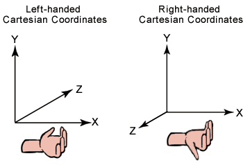

import Caption from '../../../../components/Caption.tsx';

### **좌표계와 Pseudovector**

DirextX, Metal, Vulcan과 같은 Graphics API나 Blender, Maya등 모델링 툴 등에서 스펙을 정의할 때 해당 프로그램이 왼손/오른손 좌표계 중 어떤 좌표계를 사용하고 있는지 명시하는 것을 볼 수 있다.
왼손/오른손 각 좌표계에서 x, y축에 대해 z축 방향이 반대로 나타나는 것을 볼 수 있으며, 툴을 사용함에 있어 좌표계에 대한 기준을 일관성 있게 사용하여야 한다. 이러한 차이는 Pseudo vector의 개념으로부터 발생한다.

 
### **Polar vector & Pseudovector**
 
#### **Polar vector(일반 벡터, 진짜 벡터)**

일반적으로 벡터라고 부르는 것들은 대부분 polar vector라고 할 수 있다.

- 위치, 속도, 가속도, 힘, 법선 방향 등등
- 좌표계가 회전하면 같이 회전하고, 좌표계를 반전(거울 대칭, 오른손→왼손)하면 부호까지 그대로 따라간다.

수학적으로 보면, 좌표 변환 행렬 R에 대해

$$
\mathbf{v}' = R \mathbf{v}
$$

처럼 변환되는 벡터들을 의미한다.

#### **Pseudovector (축벡터, 가짜 벡터)**

Pseudovector는 두 벡터의 외적에서 추출되는 벡터처럼, 면의 회전 축/방향을 나타내는 벡터다.

- 각속도, 토크, 자기장, 외적 벡터 등
- 좌표계를 회전시키면 일반 벡터처럼 같이 회전한다.
- 좌표계를 반전 시키면 부호가 한 번 더 뒤집힌다.

외적의 예시를 통해 보면

$$
\mathbf{a} \times \mathbf{b}
$$

에서 a, b는 polar vector지만, 그 결과는 Pseudovector가 된다. 외적 벡터의 두 방향 중 어느 방향을 선택해도 외적의 성질에는 변함이 없으며, 방향을 어떻게 정의하느냐에 따라 바뀔 수 있다.
 
### **게임 엔진 좌표계와 Pseudovector**

상용 게임엔진(UE, Unity, Godot 등등)은 각자 오른손/왼손 좌표계, Up 방향(Z-up, Y-up)등의 기준이 조금씩 다르다.
이런 차이는 사실 좌표계의 반전성 변환(parity transformation)과 관련이 있고, 이때 Pseudovector의 변환 규칙을 무시하면 문제가 생긴다. 아래는 그러한 상황이 될 수 있는 예시들이다.

1. **오른손 ↔ 왼손 좌표계 변환**
DCC 툴(Blender, Maya) → 게임 엔진으로 메시/애니메이션을 임포트하는 흔한 상황에서, Z-forward vs -Z-forward, Y-up vs Z-up 같이 축을 반전시키는 변환을 적용하게 된다.
이러한 경우 다음의 내용을 고려해야 한다.
- 위치, 속도, 방향 벡터(Poloar vector)는 단순히 축 반전 행렬로 곱해 주면 된다.
- 하지만 각속도, 토크, 외적 기반 방향 같은 Pseudovector는 패리티가 바뀔 때 추가 부호 반전을 고려해야 한다.

2. **법선과 탄젠트 공간**
표면 법선(normal) 자체는 단순 방향 벡터이지만, 탄젠트, 바이탄젠트와 외적 관계로부터 만들어지는 축벡터들은 Pseudovector 해석이 섞여 있다. 
좌표계 반전(미러링, 스케일 -1) 시 탄젠트 스페이스의 handedness가 바뀌고, 이 부분을 제대로 처리 하지 않으면 normal map이 뒤집히거나, 좌우 반전 시 광원이 이상하게 보일 수 있다.

3. **물리 엔진에서 회전량과 각속도**
회전축과 각속도는 전형적인 Pseudovector로, 행렬/쿼터니언으로 회전을 옮길 때, 좌표계를 반전(미러)하면 회전 방향의 정의도 바뀐다.
이러한 상황에서 단순히 축만 반전하면, 실제 회전 방향이 반대로 도는 문제를 겪을 수 있다.
 
### **행렬식과 Pseudovector의 변환**

좌표 변환 행렬 R에 대해,

- det(R) > 0: 순수 회전 (오른손 → 오른손, 왼손 → 왼손)
- det(R) < 0: 반사가 포함된 변환 (오른손 ↔ 왼손)

일반 polar vector v는 항상

$$
\mathbf{v}' = R\mathbf{v}
$$

로 변환된다. 하지만 Pseudovector w는

$$
\mathbf{w}' = \det(R)\;R\mathbf{w}
$$

와 같이, 행렬의 determinant 부호까지 곱해서 변환된다고 해석할 수 있다.

외적의 예시를 통해 보면

$$
\mathbf{a}' = R\mathbf{a}, \quad \mathbf{b}' = R\mathbf{b}
$$

일 때

$$
\mathbf{a}' \times \mathbf{b}' = \det(R)\,R(\mathbf{a} \times \mathbf{b})
$$

이 성립한다(즉, a x b는 Pseudovector이다.). 특정한 벡터 연산들이 Pseudovector 성질을 가진다는 걸 염두에 두고, 좌표계 변환 시 determinant 부호를 고려할 필요가 있다.