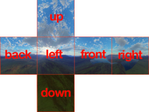

import Caption from '../../../../components/Caption.tsx';

### Cube Mapping

6장의 텍스처를 사용하여 큐브 형태로 매핑하는 기법. 환경 맵이나 아래에서 사용할 Point light의 shadow map등에 이용된다.
일반적으로 X, Y, Z각 축(+, -)에 대한 정사각 이미지로 구현된다. OpenGL에서는 `GL_TEXTURE_CUBE_MAP` / HLSL에서는 `TextureCube` 시맨틱으로 표현되며 지정한 Lookup vector를 사용하여 샘플링한다.


<Caption text="Cube texture 의 형태"/>
```hlsl
float3 v = float3(x,y,z); // some lookup vector
float4 color = gCubeMap.Sample(gTriLinearSam, v);
```
<br/>
전방향을 커버하는 매핑 기법 중 구면 매핑과 비교해서 보다 왜곡이 적고 연산이 간단하지만 아래와 같은 문제들이 있다.

- 면 경계 왜곡: Gnomonic 투영으로 인한 면 간 불연속성, 면의 외곽으로 갈수록 왜곡이 커진다.
- 6면을 커버하기 위해 6배 텍스처 용량 필요하다.

아래는 이를 보정하기 위한 방안과 사례

| 방법           | 설명                          | 적용 사례                    |
|----------------|-------------------------------|------------------------------|
| 압축 포맷      | BC6H/ETC2 사용해 VRAM 절약    | 모바일 GPU                   |
| 가변 레이아웃  | Lat-Long → 큐브맵 변환        | HDR 환경맵 처리              |
| 프록시 필터링  | 중요도 샘플링으로 성능 향상   | UE5 루멘 글로벌 일루미네이션 |

---
<br/>
