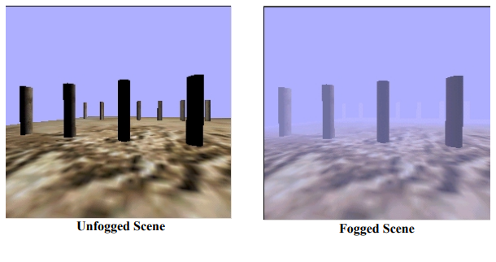
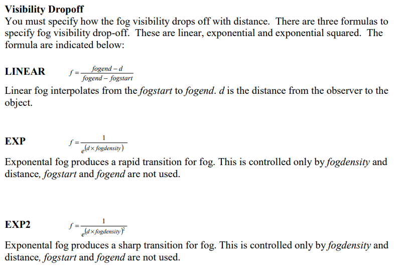

import Caption from '../../../../components/Caption.tsx';

### **D3D9 Fog**

D3D9 사양에서는 API 스펙으로 Fog기능을 지원하였다. `D3DRENDERSTATE_RANGEFOGENABLE` 등의 정의된 render state설정을 변경하는 것으로 셰이더 없이 Fog효과를 간단하게 적용할 수 있었다.



Vertex based / Table based 두 가지 타입의 fog 가 존재하였으며, 다음과 같은 Fog의 몇 가지 속성을 수정할 수 있었다.
- Distance Calc (Range / Plane)
- Drop off (Linear / Exponential)
- Z based / W based

#### **Fog Type**
- Vertex Fog : Fog coverage value가 각 정점마다 계산되어 삼각형 내에서 보간된다.
- Table Fog(Pixel fog) : 정점과 독립적으로 계산된다.(픽셀기반) 

#### **Distance Calculation option**
- Plane Based Fog : Viewplane을 기준으로 정의되는 fog, View plane과의 거리를 기준으로 fog가 정해진다. 이로 인해 유저가 시점을 회전하여 viewplane이 변경되는 경우 물체가 갑자기 나타나거나 사라지는 효과가 생길 수 있다.
- Range Based Fog : 특정 포인트로부터의 거리를 기준으로 정의되는 Fog, 계산 비용이 더 비싸지만 Plane방식에 비해 의도하지 않은 효과가 적다. pixel 방식과 함께 사용할 수 없다.

#### **Drop-off**
- Linear Fog : fogstart, fogend지점을 기준으로 카메라와의 거리에 따라 선형적으로 안개 양이 증가하는 방식.
- Exponential Fog : 카메라와의 거리에 대해 지수 함수로 안개 양이 증가하는 방식.



#### **Z based / W based**
- Z based Fog : View space Z(또는 depth buffer의 z값)를 기준으로 안개를 계산하는 방식. 원근 투영에서 Z값은 0~1 구간에 비선형적으로 분포하므로, 카메라에 가까운 영역의 깊이 변화가 더 촘촘하게 표현되고 먼 영역에서는 깊이 변화가 뭉쳐 보인다. 비용이 저렴하지만, 원근 왜곡으로인해 안개 변화가 깊이 범위에 따라 균일하지 않게 느껴질 수 있다.
- W based Fog : 투영 전/후의 W(1 / view-space Z)에 기반해 안개를 계산하여, 원근 보정을 고려한 방식. Z 기반보다 먼 거리의 해상도가 더 균일해져, 넓은 뷰에서 안개가 보다 자연스럽게 분포한다.

#### **Application of Fog**

기본적으로 적용 전 색상과 fog색상을 혼합하는 방식으로 적용한다. Vertex Fog 의 경우 정점의 alpha를 대신 사용한다.
```glsl
Pixel = FogFactor * (Color before Fog) + (1 - FogFactor) * FogColor
```
<br/>
D3D10 부터는 Fog가 D3D스펙에서 제외되었다. 렌더링 파이프라인이 Shader-programmable하게 변경되면서 Depth-map 활용의 일종에 불과한 Fog의 전용 상태가 필요없어지게 되었다.
그래픽적으로도 셰이더와 포스트 프로세싱을 사용한 커스텀 Fog를 구현하는 것이 더 나은 상황이 되었다.

기본적인 Fog의 요소들을 학습하기에는 D3D9의 Fog specification을 확인하는 것이 도움이 될 수 있다.
<br/>
### References

[https://developer.download.nvidia.com/assets/gamedev/docs/Fog2.pdf](https://developer.download.nvidia.com/assets/gamedev/docs/Fog2.pdf)
[https://www.pixelmaven.com/jason/articles/ATI/JasonM_Shading.pdf](https://www.pixelmaven.com/jason/articles/ATI/JasonM_Shading.pdf)