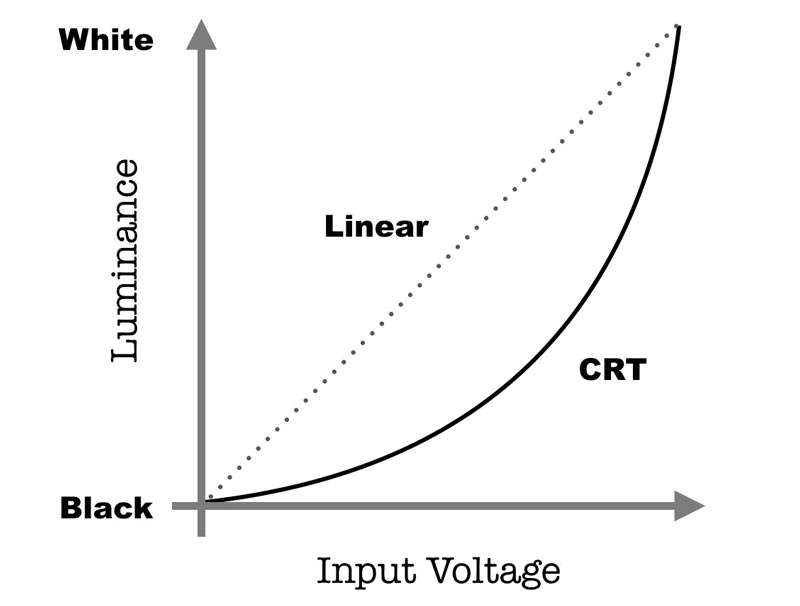
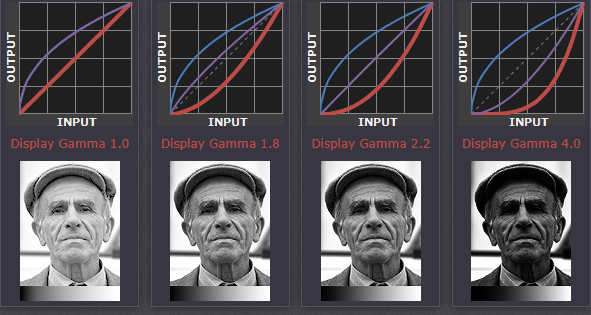
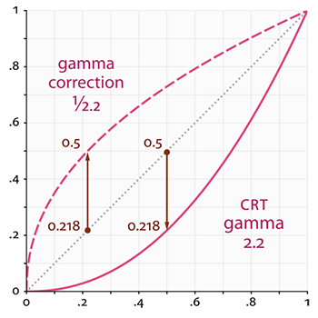

import Caption from '../../../../components/Caption.tsx';

게임 테크랩 과정에서 Normal mapping을 구현하면서 Gamma correction을 정확하게 적용해야할 필요성이 생겼다. 함께한 동료분의 설명을 들으면서 이해가 부족한 부분이 있었던 것 같아
글과 함께 DirectX환경에서 실질적으로 어떻게 적용하는지에 대한 내용을 정리하는 목적으로 작성한다.

### **Gamma Correction**

조명, 텍스처링 등 색상/밝기를 다루는 작업에서 우리는 그 값이 당연하게 더하고 곱하는 연산을 수행한다. 이는 해당 값들이 선형적으로 구성되어 있다는 것을 전제한다.
하지만 실제로는 선형으로 텍스처 및 버퍼를 인코딩하면 다양한 시각적 아티팩트들이 발생하게 된다.


<Caption text="Detected light of human eyes and camera"/>

위 그래프와 같이 사람의 눈은 어두운 색상에 더 민감하게 반응한다. 색상을 인코딩할 때 보통 8비트 범위 등 정해진 비트 안에서 색상값을 분포시켜야 하는데,
선형 분포로 값을 쪼개면, 사람의 눈이 더 민감한 어두운 쪽에 충분한 단계가 배분되지 않는다. 그로 인해서 그림자나 그래디언트에서 계단처럼 보이는 밴딩이 두드러지고, 감마 인코딩을 적용한 경우에 비해 같은 비트 수에 대한 표현력이 떨어진다.

또한 일반적으로 사용하는 디스플레이의 경우 그 입력 파워에 대비한 밝기가 선형적으로 분포지 않는다는 특징이 있다. 이는 과거 사용하던 CRT모니터의 특성을 모방한 것으로 대략 아래와 같은 관계를 가진다.

$$
L∝V^γ ,γ≈2.2
$$


<Caption text="CRT monitor`s luminance by input voltage"/>

L은 실제 화면의 휘도, V는 입력 신호의 전압으로 입력 전압에 대해 지수적으로 휘도가 결정되는 모습을 보인다. 예를 들어 입력 신호 전압이 0.5인 경우 대략적인 위도는 $0.5^{2.2}$인 0.22정도가 되며,
이는 출력 휘도가 입력에 대비하여 비선형적으로 어두워짐을 알 수 있다. 이 비율은 사람의 눈이 빛을 인식하는 정도과 거의 역수관계로 우연히 일치하는 특성이 있었다.
그러한 특징으로 인해 CRT모니터를 사용하던 당시에는 이러한 관계를 그대로 활용하였다. 현대의 모니터는 CRT모니터와 유사한 감마 곡선을 구현하도록 설계되거나 sRGB와 같은 표준 전송 함수를 통해 비선형 응답을 표현한다.

아래 그림은 sRGB형식으로 인코딩된 이미지 파일이 디스플레이의 감마값(지수 부분)에 따라 출력되는 이미지가 어떻게 변화하는지를 보여주는 그림이다.
<br/>

<Caption text="Image output by display gamma"/>

감마 보정은 일반적으로 이러한 디스플레이의 전이 함수 효과를 상쇄하기 위해 전이 함수의 역을 적용하는 과정을 의미한다.
이상적인 경우는 이미지의 인코딩된 색상 곡선이 디스플레이의 전이 함수와 동일하여 분포가 선형을 이루는 것이다.

만약 디스플레이의 감마 보정값이 인코딩된 감마값보다 작다면 실제 이미지보다 밝은 이미지를 보게되며, 선형으로 인코딩된 이미지를 일반적인 감마값의 디스플레이에서 보게될 경우 실제보다 어둡게 보게된다.


<Caption text="Display gamma and Gamma correction"/>
<br/>

### **Gamma Correction in DirectX11**

기본적으로 DirectX11의 경우 Format을 지정하는 것만으로 감마 보정을 자동으로 시행한다. `DXGI_FORMAT_R8G8B8A8_UNORM_SRGB` 와 같이
_SRGB가 붙은 포맷은 텍스처에 저장된 값을 sRGB 감마 인코딩된 값으로 해석해서, 샘플러 단계에서 자동으로 선형 공간으로 변환한다.

```cpp
// sRGB 데이터 포맷 구성 예시
DXGI_FORMAT format = DXGI_FORMAT_R8G8B8A8_UNORM_SRGB;

// 텍스처/뷰 생성 시 포맷에 _SRGB를 사용
D3D11_TEXTURE2D_DESC texDesc = {};
texDesc.Format = format;
/...
device->CreateTexture2D(&texDesc, initData, &AlbedoTexture);

D3D11_SHADER_RESOURCE_VIEW_DESC srvDesc = {};
srvDesc.Format = format; // 중요: SRV도 SRGB 포맷
...
device->CreateShaderResourceView(AlbedoTexture, &srvDesc, &AlbedoSRV);

```
`DXGI_FORMAT_R8G8B8A8_UNORM` 와 같이 _UNORM이 붙은 포맷은 은 값을 그대로(0~1 선형) 해석하기 때문에, 감마 보정이 필요하다면 별도로 셰이더에서 코드를 작성해야 한다.
일반적으로 실제 색상값으로 사용되는 정보가 아닌 Depth map, Normal map등이 UNORM포맷을 사용한다.

```cpp
// 선형 데이터 포맷 구성 예시
DXGI_FORMAT normalFormat = DXGI_FORMAT_R8G8B8A8_UNORM;

texDesc.Format = normalFormat;
...
device->CreateTexture2D(&texDesc, initData, &NormalTexture);

srvDesc.Format = normalFormat;
device->CreateShaderResourceView(NormalTexture, &srvDesc, &NormalSRV);
```

아래와 같이 게임 별도의 감마값을 상수 버퍼로 넘겨주어 보정을 임의로 할 수도 있다. 이러한 경우는 게임 엔진 등에서 디자이너가 조정할 수 있도록 하는 등 의도적으로 감마를 조정하기 위한 방법이다.
```hlsl
cbuffer Gamma : register(b1)
{
    float GammaValue;
    float3 GammaPadding;
}

...
float4 main(PS_Input Input) : SV_TARGET
{
    float4 Scene = SceneTexture.Sample(CompositingSampler, Input.UV);
    Scene = pow(Scene, GammaValue);
    ...
}
```
<br/>
### References
[https://www.cambridgeincolour.com/tutorials/gamma-correction.htm]  