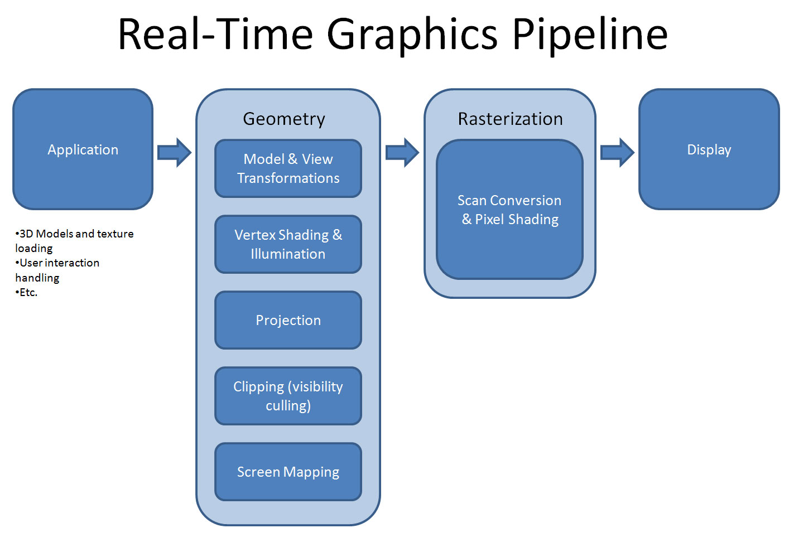
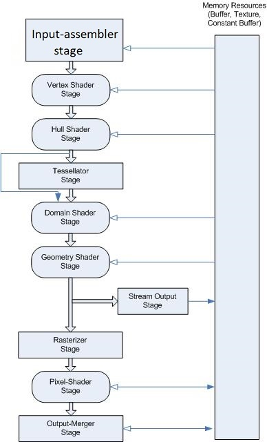
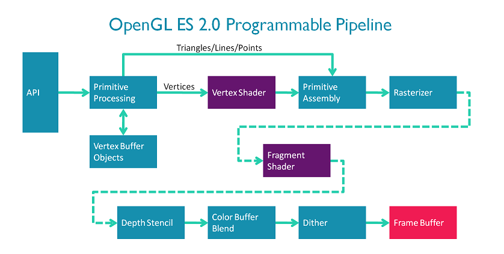
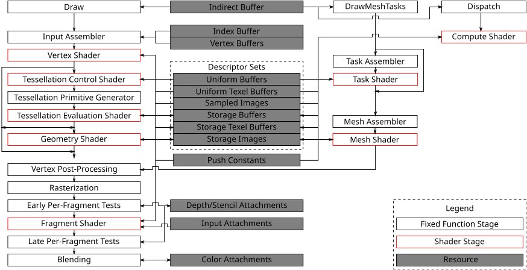

import Caption from '../../../../components/Caption.tsx';

### **Canonical view of graphics pipeline**
그래픽스 파이프라인(렌더링 파이프라인)은 3D 공간의 정보(기하 정보, 환경 특성, 카메라 등)를 입력으로 받아, 여러 단계의 변환을 거쳐 2D 픽셀 버퍼를 만드는 과정으로 볼 수 있다.
그 목적에 따라 아키텍처는 다양하게 나뉠 수 있으나, Canonical하게 보면 일반적으로는 아래와 같은 4단계로 구성된다.

#### **1. Application Stage**
주로 CPU에서 실행되는, 엔진/게임 로직 위주의 단계로, Compute shader를 사용하는 일부 작업 등을 제외하면 그래픽스 API 바깥에서 이뤄지는 일들로 구성되어있다.
다음과 같은 작업들이 수행될 수 있는 단계이다.

- Scene management: Culling, LOD, Visibility test 등.
- 게임/시뮬레이션 로직: 입력 처리, 물리, AI simulation, 애니메이션 계산 등.
- Transformation 계산: 모델 행렬, 카메라 행렬, 투영 행렬 등.
- 리소스 관련 작업: 머티리얼/메시/텍스처/버퍼 바인딩 준비, 모델 로딩 등.

이 단계에서 렌더링할 지오메트리 목록과 각 지오메트리의 변환/머티리얼/셰이더 상태 등을 출력으로 Draw call을 시행한다.

#### **2. Geometry Processing Stage**
응용 단계에서 넘겨준 기하 데이터를 받아, 렌더링할 정보를 Vertex/primitive 단위로 계산한다. 주로 다음과 같은 작업들을 수행하게 된다.

- 입력받은 변환 행렬을 사용한 실제 계산 작업, MVP변환.
- 정점 셰이딩(Vertex Shading), 상황에 따라 광원 처리.
- Visibility culling(frustum culling)
- Screen mapping, NDC범위를 실제 뷰포트로 매핑하는 작업.

기하 처리 단계를 거치면 2D 스크린 공간에서의 삼각형 및 보간 정보가, 래스터라이저로 넘어간다.

#### **3. Rasterization Stage**
기하 처리 단계에서 입력받은 삼각형 정보를 받아 화면에 그려낼 픽셀로 변환하는 단게이다. 주로 다음과 같은 작업들이 수행된다.

- Triangle Setup :전달된 정점 3개로 삼각형을 정의하고, 모서리 방정식/보간 계수 등을 준비.
- Triangle Traversal: 스크린 공간에서 해당 삼각형이 덮는 픽셀을 스캔하면서, 각 픽셀 위치에 대해 fragment를 생성.
- Pixel Shading: 정점에서 넘어온 속성(Color, UV, Normal ...)을 픽셀 위치 기준으로 보간/적용, 텍스처 샘플링, 조명 처리, Post Processing 등을 수행한다.

래스터라이저 단계를 통해 화면상의 각 잠재적 픽셀에 대한 fragment 집합과, 그에 대응하는 보간된 속성들을 Display단계로 전달한다.

#### **4. Display Stage**
마지막 단계는 각 fragment를 실제 화면 픽셀로 보여주는 과정이다. 주로 다음과 같은 작업이 수행된다.

- Depth/Stencil Test: fragment가 기존 픽셀보다 앞에 있는지, 스텐실 조건을 통과하는지 등을 판정한다.
- Blending / Output Merger: 기존 프레임버퍼 값과 새로운 색을 alpha, add, multiply 등 블렌딩 규칙에 따라 합성.
- 최종 색이 프레임버퍼에 저장되고, 실제 디스플레이에 보여준다.
 
### **D3D11 그래픽스 파이프라인으로 보다 자세한 단계 확인하기**

<Caption text="D3D10/11 programmable pipeline"/>

보다 구체적인 아키텍처의 예시를 통해 실제 그래픽스 파이프라인 구성을 살펴보면 다음과 같은 단계들이 존재한다. 
위는 D3D11의 파이프라인 단계 구성으로 D3D10의 구성을 포함한다. 다른 Graphics API역시 단계의 명칭이 다를 뿐 비슷한 방식으로 구성되어 있는 것이 많다.

#### Input Assembler
- Vertex buffer/Index buffer에서 원시(primitive) 데이터(포지션, 법선, UV, 인덱스)를 읽어온다.
- 점/선/삼각형 등 primitive topology의 설정 등을 변경할 수 있다.

#### Vertex Shader
- IA단계에서 받은 정보를 기반으로 Vertex당 이루어지는 연산을 처리한다.(Transformation, Skinning, Morphing ...)

#### (D3D11 Optional) Tessellation Stages
Hull Shader, Tessellator, Domain Shader의 세 단계로 구성된 D3D11 런타임의 특수 단계. 폴리곤 수가 적은 저해상도 메시를 GPU차원에서 더 높은 디테일로 렌더링하기 위해 만들어진 Stage.
전송해야할 기하 정보를 줄이면서 퀄리티를 높이기 위한 목적으로 탄생하였다. 

#### Geometry Shader
- 하나의 primitive(triangle, line ...)를 입력 받아, 여러 개의 새로운 primitive를 동적으로 생성·변형·삭제하는 역할을 수행한다.
- Particle, Outline, LOD처리 등에서 활용될 수 있다.

#### Rasterizer
- 3D primitive를 화면 좌표로 투영 후, 픽셀 프래그먼트를 생성한다.
- 벡터 정보의 래스터 이미지화

#### Pixel Shader
- 픽셀당 수행되는 연산에 대한 처리, 텍스처 샘플링, lighting, Shadow, Post-Processing 등을 계산해 최종 색을 산출한다.

#### Output Merger
- 깊이/스텐실 테스트, 블렌딩(alpha blend, additive), 실제로 프레임버퍼에 쓰는 작업을 수행한다.

### **OpenGL graphics pipeline**
 

<Caption text="OpenGL ES 2.0 programmable pipeline"/>

OpenGL의 그래픽스 파이프라인 아키텍처도 Canonical view에서 벗어나지 않은 모습을 볼 수 있다. D3D11과 비교하면 programmable한 shader단계가 적다.(Vertex shader, Fragment Shader)
 

### **Vulkan graphics pipeline**
 

<Caption text="Vulkan programmable pipeline"/>

모던 그래픽스 API중 하나인 Vulkan도 그래픽스 파이프라인 아키텍처만 보면 크게 다르지 않다.
 
### References
[https://www.cgchannel.com/2010/11/cg-science-for-artists-part-2-the-real-time-rendering-pipeline/]
[https://learn.microsoft.com/en-us/windows/win32/direct3d11/overviews-direct3d-11-graphics-pipeline]
[https://wikis.khronos.org/opengl/Rendering_Pipeline_Overview]
[https://arm-software.github.io/opengl-es-sdk-for-android/introduction_to_shaders.html]