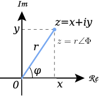

import { YouTube } from 'astro-embed';
import Caption from '@/components/Caption.tsx';

https://youtu.be/irHeNZpOc74?si=MKD1ZVkL03n0zNuw

<Caption text="버튜버 연떠 님의 현대 대수학 강의"/>

### 복소수와 복소평면

흔히 아는 것과 같이 복소수 z는 실수부 x와 허수부 y로 이루어져 있으며 다음과 같이 쓴다.

$$
z = x + iy, \quad x, y \in \mathbb{R}, \; i^2 = -1
$$

복소평면은 복소수를 x축을 실수부 x, y축을 허수부 y로 하여 좌표평면의 형식으로 나타낸 것으로
복소수 z = x + iy는 점 (x, y) 또는 원점에서 (x, y)까지의 벡터로 표현된다.

복소수의 크기(절댓값) 와 편각은 다음과 같이 정의할 수 있다.

$$
|z| = \sqrt{x^2 + y^2}, \quad \arg z = \theta
$$

 
### 복소수의 대수적 표현/극형 표현

복소수 (z = x + iy)는 직교좌표(대수형)와 극좌표(극형)로 해석할 수 있다 각각의 경우 다음과 같이 표현된다.

1. 직교형(Cartesian form)

$$
z = x + iy
$$

2. 극형(Trigonometric form)

복소수의 크기를 r, 편각을 θ라 하면

$$
x = r\cos\theta,\quad y = r\sin\theta
$$

이므로

$$
z = x + iy = r(\cos\theta + i\sin\theta)
$$

로 쓸 수 있다.

 
### 단위복소수

크기가 1인 복소수(절댓값이 1인 복소수)를 단위복소수(unit complex number) 라 하며, 극좌표에 관점에서 보면

$$
|z| = 1 \quad \Longleftrightarrow \quad z = \cos\theta + i\sin\theta
$$

와 같이 단위 원 위의 점으로 볼 수 있다.

즉, 모든 단위복소수는 어떤 실수 (theta)에 대해

$$
z = \cos\theta + i\sin\theta
$$

로 쓸 수 있고, 이때 (theta)를 그 복소수의 편각(또는 각도)라고 부른다.

 
### 복소수의 곱셈

복소수를 극좌표 관점에서 아래와 같이 쓰면

$$
z_1 = r_1(\cos\theta_1 + i\sin\theta_1), \quad
z_2 = r_2(\cos\theta_2 + i\sin\theta_2)
$$

두 복소수의 곱은

$$
\begin{aligned}
z_1 z_2
&= r_1 r_2 \big(\cos(\theta_1 + \theta_2) + i\sin(\theta_1 + \theta_2)\big)
\end{aligned}
$$

이 된다. 이 식은 복소수 곱셈이 그 크기는 곱하고 각도(편각)는 더하는 회전을 의미하는 연산임을 알 수 있다.
특히 단위복소수 는 크기가 1이고 각도가 θ인 복소수이므로, 임의의 복소수 z에 대해

$$
z' = uz
$$

를 계산하면 z의 크기는 그대로 유지되고 편각만 θ만큼 증가하는 연산이 된다.
즉, 복소수 z를 원점 기준으로 θ라디안 회전시킨 결과가 된다.

 
### 오일러 공식과 단위복소수

오일러 공식에 따르면

$$
e^{iθ} = \cos\theta + i\sin\theta
$$

이므로, 모든 복소수는 다음과 같은 지수형으로 쓸 수 있다.

$$
z = r(\cos\theta + i\sin\theta) = r e^{iθ}
$$

특히 단위복소수는

$$
|z| = 1 \quad \Longrightarrow \quad z = e^{iθ}
$$

와 같이 표현된다.

 
### 드 무아브르의 정리

복소수

$$
z = r(\cos\theta + i\sin\theta)
$$

와 정수 n에 대해

$$
z^n = \big(r(\cos\theta + i\sin\theta)\big)^n
    = r^n\big(\cos(n\theta) + i\sin(n\theta)\big)
$$

이 항상 성립한다.

특히 절댓값이 1인 복소수(단위복소수)의 경우 r = 1이므로

$$
(\cos\theta + i\sin\theta)^n = \cos(n\theta) + i\sin(n\theta)
$$

이다.

이 정리는

- 복소수의 거듭제곱 계산
- 삼각함수 여러 각 공식(배각, 삼각, 다각 공식 등) 유도
- z^n = 1과 같은 방정식의 해 분석

등에서 활용할 수 있다.

 
### n차 단위근 (n-th roots of unity)

양의 정수 n에 대해, 다음 방정식

$$
z^n = 1
$$

을 만족하는 복소수 z를 n차 단위근이라고 한다.

 
### n차 단위근 구하기

드무아브르의 정리와 오일러 공식을 사용하면, z^n = 1의 모든 해를 구할 수 있다.

1을 극좌표를 사용하여 아래와 같이 나타내면
$$
1 = e^{2\pi i k} \quad (k \in \mathbb{Z})
$$

z = $e^{i\theta}$ 라고 두고 z^n = 1을 다음과 같이 나타내면
$$
(e^{i\theta})^n = e^{in\theta} = 1 = e^{2\pi i k}
$$
이므로
$$
in\theta = 2\pi i k \quad \Rightarrow \quad \theta = \frac{2\pi k}{n} \quad
$$

따라서 n차 단위근은 다음과 같은 꼴로 해가 나타난다.
$$
z_k = e^{2\pi i k / n}
    = \cos\frac{2\pi k}{n} + i\sin\frac{2\pi k}{n}
$$
k = 0,1 ... n-1에 대응하는 값들이 n차 단위근이며, 모든 단위근의 합은 0이 되는 성질을 가진다.(복소 평면에서의 대칭성을 가짐을 직관적으로 생각할 수 있음)
 

### 복소평면에서의 기하학적 의미

각 z_k의 크기는

$$
|z_k| = \left| e^{2\pi i k/n} \right| = 1
$$

이므로, 모든 n차 단위근은 단위원(반지름 1인 원) 위에 있다.
편각은

$$
\frac{2\pi k}{n}
$$

이므로 인접한 두 단위근 ${z_k}$, $z_{k+1}$ 사이의 각도 차이는 항상
$$
\frac{2\pi}{n}
$$
이고, k = 0,1 ... n-1에 대응하는 점들을 원 위에 찍고 이웃한 점들을 순서대로 이으면, 중심이 원점이고 반지름이 1인 원에 내접하는 정n각형의 꼭짓점들이 된다.

 
### 곱셈 구조

n차 단위근들의 집합을 ${z_0}$, ${z_1}$ ... $z_{n-1}$라 하면, 곱셈에 대해 다음이 성립한다.

- 곱셈 닫힘성:
  $$
  z_j z_k = e^{2\pi i j/n} e^{2\pi i k/n}
           = e^{2\pi i (j+k)/n}
           = z_{(j+k) \bmod n}
  $$
- 항등원:
  $$
  z_0 = e^{0} = 1
  $$
- 역원:
  $$
  z_k^{-1} = e^{-2\pi i k/n} = z_{n-k}
  $$

따라서 n차 단위근들은 곱셈에 대해 순환군(cyclic group)을 이루며, 생성원으로 자주 쓰는

$$
\omega = e^{2\pi i / n}
$$

에 대해

$$
z_k = \omega^k, \quad k = 0,1,\dots,n-1
$$

으로 나타낼 수 있다.

 
### 원시 n차 단위근

특히 ${\omega}$가

$$
\omega^n = 1 \quad \text{이고} \quad \omega^m \ne 1 \; (1 \le m < n)
$$

을 만족하면, ${\omega}$를 원시(primitive) n차 단위근이라고 부른다.

- 모든 n차 단위근은 어떤 원시 n차 단위근 ${\omega}$의 거듭제곱 ${\omega^k}$ 꼴로 나타난다.

 
### 비에트 정리(Vieta's formula)

일반적인 n차 다항식을

$$
P(x) = a_n x^n + a_{n-1} x^{n-1} + \cdots + a_1 x + a_0
$$

이라 쓰고, 이 다항식의 근(중복 포함)을 $({x_1}, {x_2} \dots {x_n})$이라 하면

- 1개씩 근을 곱해 더한 것
- 2개씩 근을 곱해 더한 것
- …
- n개 전부를 곱한 것

이 각각 계수 ${a_k}$로 표현된다.(부호의 경우 n에 따라 교차)

$$
x_1 + x_2 + \cdots + x_n
    = -\frac{a_{n-1}}{a_n}
$$

$$
\sum_{1 \le i < j \le n} x_i x_j
    = \frac{a_{n-2}}{a_n}
$$

$$
\sum_{1 \le i_1 < i_2 < \cdots < i_k \le n} x_{i_1} x_{i_2} \cdots x_{i_k}
    = (-1)^k \frac{a_{n-k}}{a_n}
$$

$$
x_1 x_2 \cdots x_n = (-1)^n \frac{a_0}{a_n}
$$

비에트 정리는 0강에서 언급한 거듭제곱근으로 풀 수 있는 다항식 측면에서 중요하게 사용된다.
비에트 정리를 통해 5차 이상의 방정식은 거듭제곱근으로 풀 수 없지만(해를 계수의 사칙연산을 통해 나타낼 수 없지만),
근의 사칙연산을 총해 모든 계수를 표현할 수는 있다는 것을 알 수 있다.

비에트 정리는 다음과 같은 상황에서 사용된다.

- 근을 직접 구하지 않고 근의 합, 곱, 조합을 빠르게 계산할 때
- 올림피아드/경시 문제에서 방정식의 근들에 대한 식을 간단히 다룰 때
- 다항식의 계수를 근의 정보로부터 복원할 때

 
### 치환(permutation)

집합
$$
X = \{1,2,\dots,n\}
$$
위의 치환(permutation)은, X에서 X로 가는 일대일 대응이다. 모든 치환의 집합을 $S_n$이라 표현한다. 
이때 치환은 함수의 성질을 가져 합성할 수 있다.

 
### 케일리 치환표기

다음과 같은 형식으로 치환을 나타내는 것을 케일리 치환표기라고 한다.

$$
\sigma =
\begin{pmatrix}
1 & 2 & \cdots & n \\
\sigma(1) & \sigma(2) & \cdots & \sigma(n)
\end{pmatrix}
$$

예를 들어,
$$
\sigma =
\begin{pmatrix}
1 & 2 & 3 & 4 \\
2 & 4 & 1 & 3
\end{pmatrix}
$$
는
$
1 \mapsto 2,\; 2 \mapsto 4,\; 3 \mapsto 1,\; 4 \mapsto 3
$
을 의미한다.

 
### 궤도(orbit)

집합 X에 특정한 치환 $\sigma$를 작용할 때, 집합 X의 원소 x가 원래의 x로 돌아오기 까지 필요한 치환의 합성횟수를 궤도의 길이라고 한다.

집합 X의 원소 x가 n번의 치환을 거쳐 자기 자신으로 돌아오기까지 거친 모든 원소의 집합을 ${orb_\sigma(x)}$로 표현하고, x에 대한 $\sigma$의 궤도라고 한다.

