import Caption from '../../../../components/Caption.tsx';

### **Gouraud Shading**

삼각형 메시의 연속적인 라이팅을 구현하기 위한 고전적인 셰이딩 기법의 하나이다. Vertex normal을 기반으로 조명을 계산하는 방식으로 Light계산은 PS가 아니라 VS단계에서 처리한다.

(Flat Shading \> Gauroud Shading \> Phong Shading \> PBR…)


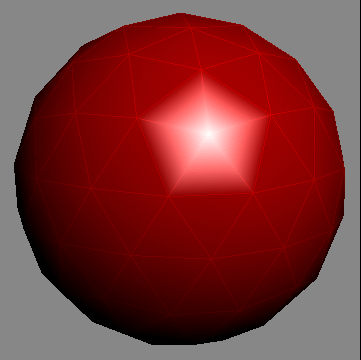 
<Caption text="Gouraud shading 적용 예시" />

Vertex normal을 기준으로 각 정점에서 조명을 계산한 뒤, 그 결과(색상/밝기)를 face 내부 픽셀들에 대해 보간한다. 
정점의 수가 작은 경우 오브젝트가 움직일 때 법선 변화가 커 라이팅이 불규칙적으로 보이는 현상이 존재할 수 있다.(라이팅 적용에 있어 Mach bands effect 발생)

Gouraud shading \> vertex에서 조명 계산 후 색상을 보간  
Phong shading \>  Normal을 보간한 뒤 픽셀 단위로 조명을 계산

[Wikipedia - https://en.wikipedia.org/wiki/Mach\_bands](https://en.wikipedia.org/wiki/Mach_bands)

### **Lambertian Reflectance**

관찰자의 시야각에 관계없이 동일한 밝기로 반사하는 표면반사 개념(Isometric model). 람베르트 코사인 법칙을 따르는 반사로, 표면의 법선과 광원 방향의 내적을 기반으로 계산된다.(따라서 관찰자의 시점은 관계 없음)
아래의 식과 같이 밝기를 정의한다.(법선과 광원 방향을 단위 벡터로 가정하여 내적 값이 1이 되기에 cos값만 남는다.)
```glsl
I = C⋅I⋅cos(θ) // I - intensity of light 
```
<br/>
아래 이미지와 같이 각도에 따라 단위 면적 당 광량의 개념으로 이해하면 직관적이다. N L의 각도가 커짐에 따라 점점 광량이 감소하여 수직이 될 때 광량이 0이 된다.  
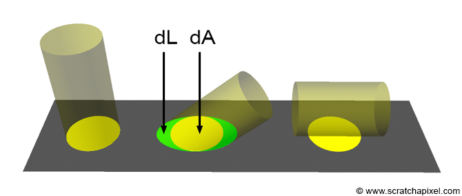

실제로 반사된 밝기를 구할 때의 공식은 아래와 같다.
```glsl
hitColor = hitObject->albedo / M_PI * light->intensity * light->color * std::max(0.f, hitNormal.dotProduct(L));
```
<br/>
Lambertian cosine law에 정의된 항과 별개로  albedo/PI 값이 추가로 곱해지게 되는데 albedo는 반사율로 reflected light/incident light로 정의되는 값이다. 
PI로 나눠주는 이유는 입사 광원이 반구 형태로 반사되는 것으로부터 발생하는 요소이다. 반사 광에 대한 2중 적분으로부터 아래의 식과 같이  
반사 광량의 적분값(반구형상으로 반사되는 광에너지의 총 합)이 입사 광량 보다 같거나 작아야 한다.(에너지 보존 법칙)

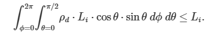  

위 식을 정리하면 아래와 같은 부등식을 얻는다.(입사 광량의 값을 1로 정의하는 경우)

```glsl
(albedo(rho) * 2PI) / 2 <= 1  
-> albedo * PI <= 1
```

이 수식이 0 \<= albedo \<= 1 인 반사율 값에서 항상 성립하기 위해서는 albedo 값을 PI로 나누어 주어야 하며, 이로 부터 hitObject->albedo / M_PI항이 발생한다.   
 
### **Phong shading**

Gouraud shading의 큰 문제인 specular highlight가 삼각형 중앙에서 올바르게 표시되지 않는 문제를 해결할 수 있는 셰이딩 기법이다.
정점 법선 자체를 보간하는 식으로 작동하여 삼각형 중앙의 highlight도 정확히 나타낼 수 있다. 광원의 관찰자 요소를 개입하는 모델로 Halfway vector를 계산에 사용한다.(Light와 Viewer 벡터의 중간 벡터)
Specular Reflection에 View direction이 계산에 포함되는 특징이 있다. (p \= phong exponent)

phong reflection model은 Ambient \+ Diffuse \+ Specular 으로 나타내어지는 표면 반사 모델으로 각각의 항은 아래와 같이 표현된다.

- Ambient Shading \> ambient reflection 계수에 선형 비례 I \= Ia \* Ka
- Diffuse Shading \> 람베르트 코사인 법칙에 따름
- Point light의 감쇠 비율 \> distance square에 반비례, 빛이 구형으로 발산하기 때문에 구의 표면적에 반비례하는 것이 기하학적으로 옳기 때문.(에너지 보존 법칙)

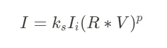

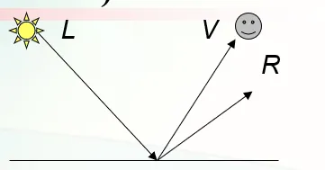 

Specular highlight(Blinn-Phong) \> Halfway Vector(H) 사용  
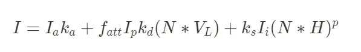

### **Normal mapping**

오브젝트 표면의 요철에 의한 라이팅을 텍스처로 처리하는 기법이다. 실제로 모델에 요철을 넣는 것 보다 효율적으로 장면의 퀄리티를 올릴 수 있다.
RGB 이미지로 되어있는 텍스처 형태로 되어있으며 RGB각 성분은 법선 벡터의 X, Y, Z 성분을 구성한다. 일반적으로 재사용성을 위해 Tangent space에서 텍스처가 정의된다.

#### **Tangent Space**

Tangent, Bitangent, Normal의 3가지 벡터 요소로 구성되는 좌표계. 오브젝트 표면의 접선(Tangent)을 축으로 하는 좌표계로 생각하는 것이 직관적이다.
- Tangent : 텍스처의 U방향과 일치하는 표면 접선 벡터  
- Bitangent : 텍스처의 V방향과 일치하는 표면 접선 벡터  
- Normal : 표면에 수직인 방향 벡터

세 가지 벡터를 통해 TBN행렬을 구성하여 Tangent Space 에서 World/View Space로의 변환에 이용한다.

다음의 과정을 통해 normal map의 값을 사용한다.

1. Decoding
- 텍스처의 색상값을 추출 (r, g, b) (r, g 0\~1 범위, b 0.5\~1 범위 b의 0 \~0.5범위는 표면의 반대 방향이므로 의미가 없음)  
- 벡터로 사용하기 위해 (-1, \+1) 범위로 변환 ex) (0.5, 0.5, 1.0) \-\> (0.0, 0.0, 1.0)  
- (Optional) 데이터 최적화를 위해 Z값이 없는 경우 X, Y 성분으로 부터 Z계산 (길이가 1임을 이용한다.)  
- 길이가 1이 아닌 경우 정규화를 통해 단위 벡터로 변환  
- TBN 행렬을 통해 법선을 월드 공간으로 변환 

```glsl
worldNormal = normalize(TBN * normal);
```

2. Tangent space 변환
```glsl
float4 Frag(PixelInput i) : SV_TARGET
{
    // 노멀 맵 샘플링 (탄젠트 공간)
    float3 normalTS = _NormalMap.Sample(sampler_NormalMap, i.uv).rgb;
    normalTS = normalize(normalTS * 2.0 - 1.0); // [0,1] → [-1,1]

    // TBN 행렬 구성 (월드 공간)
    float3x3 TBN = float3x3(i.t, i.b, i.n);

    // 탄젠트 → 월드 공간 변환
    float3 normalWS = mul(normalTS, TBN);
    normalWS = normalize(normalWS);

    // 조명 계산 (예: 람베르트 반사)
    float3 lightDir = normalize(float3(1, 1, 1)); // 광원 방향
    float ndotl = max(0.0, dot(normalWS, lightDir));
    
    return float4(ndotl.xxx, 1.0);
}

```
<br/>
**디코딩 예시**

| 픽셀 RGB 값 | 변환 후 (X, Y, Z) | 설명 |
| ----- | ----- | ----- |
| (0.5, 0.5, 1.0) | (0.0, 0.0, 1.0) | 평평한 표면 (기본 노멀) |
| (1.0, 0.5, 0.5) | (1.0, 0.0, 0.0) | 오른쪽으로 기울어진 법선 |
| (0.5, 1.0, 0.5) | (0.0, 1.0, 0.0) | 위쪽으로 기울어진 법선 |
<br/>
아래 이미지를 보면 오브젝트의 오른쪽 아래 부분은 붉은빛(U성분 높음, V성분 낮음) 왼쪽 위 부분은 녹색(U성분 낮음, V성분 높음)에 가까운 것을 볼 수 있다.

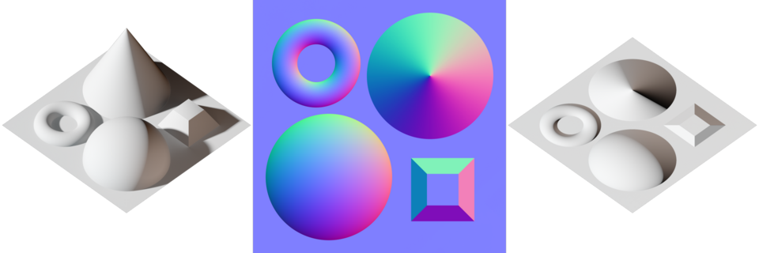

### **TBN Vector 를 계산하는 방법**

정점 데이터로 부터 계산할 수 있다.
```glsl
vec3 pos0 = vertices[index0].position;
vec3 pos1 = vertices[index1].position;
vec3 pos2 = vertices[index2].position;

vec2 uv0 = vertices[index0].texCoord;
vec2 uv1 = vertices[index1].texCoord;
vec2 uv2 = vertices[index2].texCoord;

// 삼각형의 엣지 계산
vec3 edge1 = pos1 - pos0;
vec3 edge2 = pos2 - pos0;

// 텍스처 좌표 차이 계산
vec2 deltaUV1 = uv1 - uv0;
vec2 deltaUV2 = uv2 - uv0;

// 탄젠트와 바이탄젠트 계산
float r = 1.0f / (deltaUV1.x * deltaUV2.y - deltaUV2.x * deltaUV1.y);

vec3 tangent;
tangent.x = r * (deltaUV2.y * edge1.x - deltaUV1.y * edge2.x);
tangent.y = r * (deltaUV2.y * edge1.y - deltaUV1.y * edge2.y);
tangent.z = r * (deltaUV2.y * edge1.z - deltaUV1.y * edge2.z);
tangent = normalize(tangent);

vec3 bitangent;
bitangent.x = r * (-deltaUV2.x * edge1.x + deltaUV1.x * edge2.x);
bitangent.y = r * (-deltaUV2.x * edge1.y + deltaUV1.x * edge2.y);
bitangent.z = r * (-deltaUV2.x * edge1.z + deltaUV1.x * edge2.z);
bitangent = normalize(bitangent);

```
<br/>
아래 방정식의 해를 구하는 과정이다. r 이 determinant가 되는 역행렬 곱 진행 과정으로 생각한다.
```glsl
[edge1.x edge2.x] = [deltaUV1.x deltaUV2.x] [T.x B.x]
[edge1.y edge2.y] = [deltaUV1.y deltaUV2.y] [T.y B.y]
[edge1.z edge2.z]                           [T.z B.z]

```
parsing시 정점 데이터를 통해 계산하여 넣어줄 수 있다. (Bitangent의 경우 Tangent값만 알면 Cross로 구하여도 무관)

### **Lightcuts**

다수의 Pointlights의 영향을 효율적으로 계산하기 위한 기법, 적은 오차범위에서 광원의 영향을 근사하는 방법론 이다.
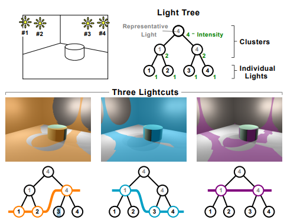

위 이미지와 같이 리프노드를 개별 광원으로하는 광원에 대한 이진 트리를 구축하는 방식으로 구현된다. 리프노드 위쪽은 광원 클러스터(2개 이상의 광원 집합)이며 클러스터의 광량은 하위 광원의 광량의 합으로 나타내어진다.
클러스터를 통해 정확도를 희생하여 여러 광원을 계산하는 비용을 줄이는 방식. 이진 트리에서 어떤 클러스터 및 개별 광원을 선택하여 ligthcut을 구성할 것인지에 대한 것은 별개의 문제이다.

클러스터는 기본적으로 공간적 근접성을 기준으로 묶이며 공간에 대한 AABB / Cone(Optional) 정보 등을 가진다. 클러스터의 대표 광원(Representative light)는 자식 노드에 해당하는 광원 중 하나와 동일하게 설정됨
루트 노드로 부터 내려가며 Lightcut을 세분화 하는 과정을 통해 사용할 Lightcut을 결정한다. 현재의 Cut에서 가장 오차가 큰 노드를 확인하고 해당 오차가 허용범위 이상이라면 클러스터의 하위 노드로 대체한다. 이러한 과정을 거쳐 모든 노드의 오차가 허용범위 안쪽이라면 해당 Lightcut을 사용한다. (허용 오차의 값은 2%가 일반적 \-  From Weber\`s law)

### **Stochastic Light Culling**

기존의 광원 감쇄 함수는 광원으로 부터의 거리제곱에 반비례하는 형태를 가진다.
```glsl
Attenuation function : f(l) = 1 / l²
```
<br/>
거리가 무한히 멀어져도 감쇄 함수의 값이 0보다 크기 때문에 무한 거리에서도 광원의 영향을 받기 때문에,
먼 거리에서 광원의 영향을 받지 않도록 하기 위해(Culling) Randomize하게 샘플링하여 확률적으로 광원의 영향 조절하는 기법이다.
```glsl
Probability function : p(l) = min(f(l) / α, 1) // α - 사용자 지정 상수 분산값
```
<br/>
위 확률함수는 광원이 l거리에서 영향을 미칠 확률을 의미하는 것으로 해석할 수 있다. 
광원이 영향을 미치는 범위를 결정하기 위해 기존 광원에 추가로 별도의 난수를 하나 부여한다. (확률함수의 값이 난수보다 작은 경우 Light를 컬링하도록 하는 목적으로 0 ~ 1 범위에서 생성한다.) 

p(r) \=  ξ(난수팩터) 의 방정식의 해를 구하는 것을 통해 영향 거리 r을 구한다. 

p(r) \= min(f(r) / α, 1\) \= ξ 가 되는 r을 구하고 l(광원-픽셀 거리)이 r이하의 값이면 광원이 영향을 미치는 것으로 보고, 아니라면 영향을 미치지 않는 것으로 본다(Culling)

Example
```glsl
ξ = 0.25,  α = 0.01 인 경우

p(r) = min(1 / (α * r²), 1) = 0.25 의 해를 구하여야 한다.

f(r) / α < 1 일때 f(r) / α = ξ → f(r) = α·ξ → r = f⁻¹(α·ξ)  
1 / r² = α·ξ → r = 1/√(α·ξ)  
r = 1 / √(0.01 × 0.25) = 20 이므로

r = 20 인 범위까지 광원이 영향을 미치게 된다.
α 팩터가 작아지면 범위가 커지고 α가 커지면 범위가 작아지는 형태가 된다.
```
<br/>
### **Tiled Shading**

Screen을 일정한 형태의 타일들로 나누고, 광원이 미치는 영향을 타일에 대해 정의하는 방식의 라이팅 광원의 영향 범위 임계값을 부여하는 것으로 통해 광원의 영향이 미치는 범위를 시각화 할 수 있다.

- 점 광원 - 구 형태  
- 스포트라이트 - 원뿔 형태  
- Directional light - Full-screen Quad 

Screen을 일정한 Tile로 나누고 위에서 만든 광원 영향 범위 메시가 Tile에 렌더된다면(실제로 렌더될 필요는 없음 \- 시각화에 대한 문제) 해당 Tile에 영향을 미치는 광원 목록에 추가한다.
모든 타일과 광원에 대해 위 작업들을 수행한 후 타일별 광원 목록을 input으로 사용하는 Shader-pass로 셰이딩을 진행한다.
위 작업은 Rendering pipeline에 독립적이기 때문에 Defered / Forward 방식에 모두 적용 가능하다. 기존 시스템은 단일한 Tile로 이루어진 방식이라고 생각할 수 있다.

나누는 타일의 수가 커질수록(타일의 크기가 작아질수록)
아래와 같은 Trade-off가 존재하므로 메모리 / 컬링 효율 사이에서 적정 해를 찾을 필요가 있다.

- 컬링이 더 자세하게 진행  
- 데이터의 저장에 큰 메모리가 필요  
- 더 많은 대역폭 소비  


Tilebased shading은 아래 이미지와 같이 3D공간의 특징으로 인해 깊이 불연속성에 대한 문제가 존재한다.  

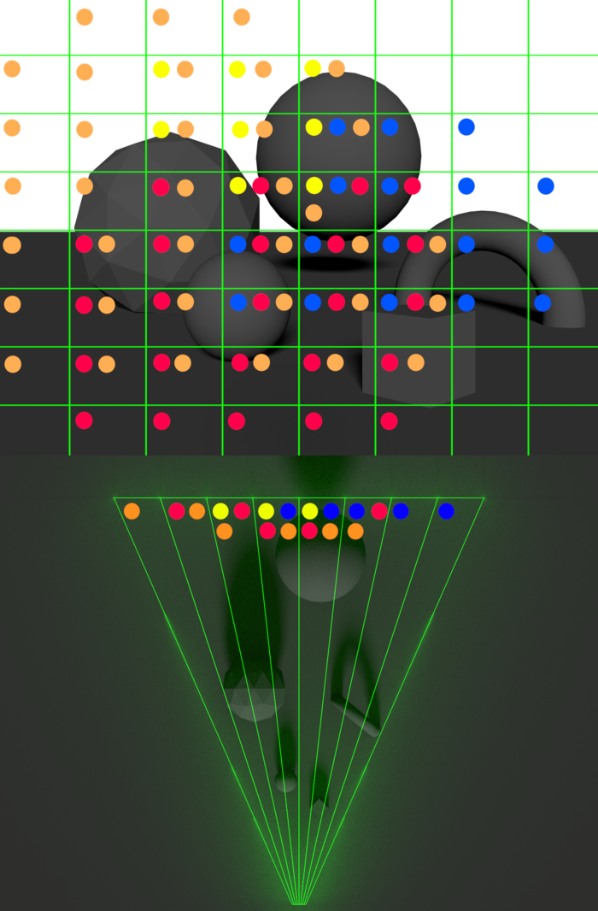

- Screen에서 하나로 표현되는 타일이 실제로는 서로 다른 깊이에 위치한 객체를 포함할 수 있다. 따라서 해당 타일은 객체에 영향을 미치지 않은 광원까지 처리해야 하는 케이스가 존재한다.
- View에 크게 의존하기에 시점에 따라 셰이딩 성능이 크게 차이날 수 있다.

이러한 문제에 대한 해결 방안의 하나로 Clustered shading을 사용할 수 있다.

### **Clustered Shading**
<br/>
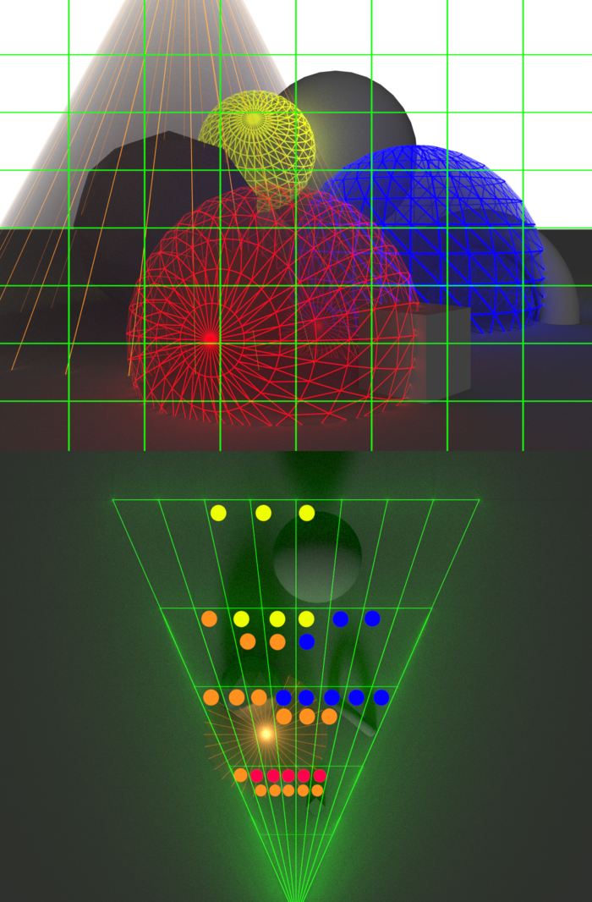

위 이미지와 같이 light culling을 확인하는데 Tile이 아닌 3D셀(Cluster)를 사용하는 방식이다. 깊이 축에서 View Frustrum을 분할하여 사용한다. 
Tiled shading으로 부터 확장되기에 Deffered / Forward 방식에서 모두 사용할 수 있으며 Z-prepass 없이도 동작한다.
View frustrum이라는 이미 알고있는 정보로 부터 정의되는 장점이 있으며 광원 컬링에 메시 정보가 필요하지 않기에 CPU단에서 컬링을 처리하여 GPU리소스를 확보할 수 있다.

### **Clusterd Shading Implementation**

기본적인 순서

1. 클러스터링 데이터 구조 구축  
2. G-버퍼 또는 Z 프리패스로 장면 렌더링  
3. 가시 클러스터 찾기  
4. 가시 클러스터 목록에서 중복 값 제거  
5. 광원 컬링 수행 및 클러스터에 광원 할당  
6. 광원 목록을 사용하여 샘플 셰이딩

클러스터 분할 방식(Depth)

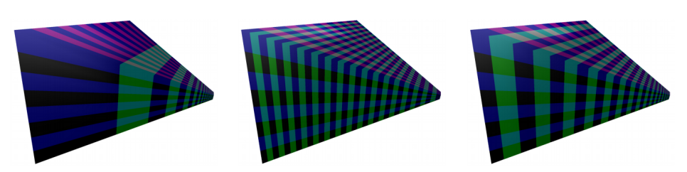
<Caption text="NDC 균등분할 / View space 균등분할 / Exponential distribution in view space" />
- NDC 기준 균등 분할 - NDC공간 깊이 비선형성으로 인해 근평면 클러스터는 매우 얇고 원평면은 두꺼워지는 문제가 존재함  
- View Space 기준 균등 분할 - 균일하게 보일 수 있으나 역으로 근평면 클러스터는 넓이에 비해 두껍고 원평면 클러스터는 넓이에 비해 얇아 비효율적  
- 이러한 문제로 인해 NDC 기준으로 분할하되 지수함수를 추가로 도입하여 비선형성을 어느 정도 상쇄하는 방식이 효과적(self-similar subdivisions 달성을 위함)

### References
[https://www.realtimerendering.com/advances/s2006/Chapter7-Shading\_in\_Valve's\_Source\_Engine.pdf](https://www.realtimerendering.com/advances/s2006/Chapter7-Shading_in_Valve's_Source_Engine.pdf)  
[https://advances.realtimerendering.com/s2006/Mitchell-ShadingInValvesSourceEngine.pdf](https://advances.realtimerendering.com/s2006/Mitchell-ShadingInValvesSourceEngine.pdf)  
https://drivers.amd.com/developer/gdc/D3DTutorial10\_Half-Life2\_Shading.pdf  
[https://www.cse.chalmers.se/~uffe/clustered_shading_preprint.pdf](https://www.cse.chalmers.se/~uffe/clustered_shading_preprint.pdf)