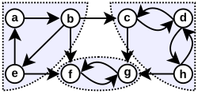
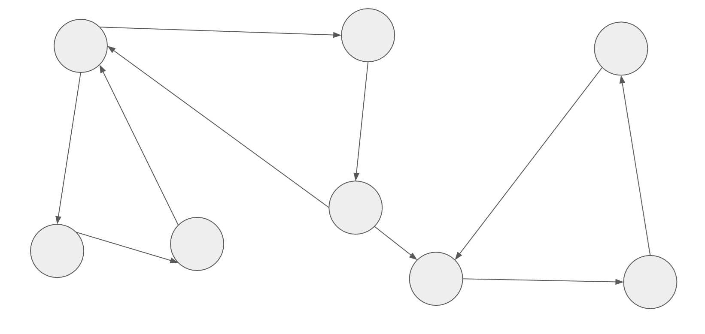
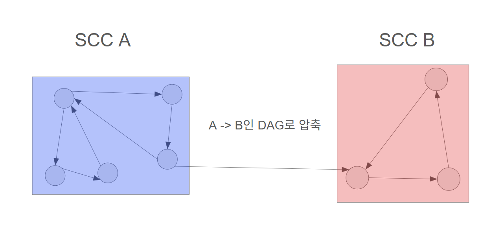
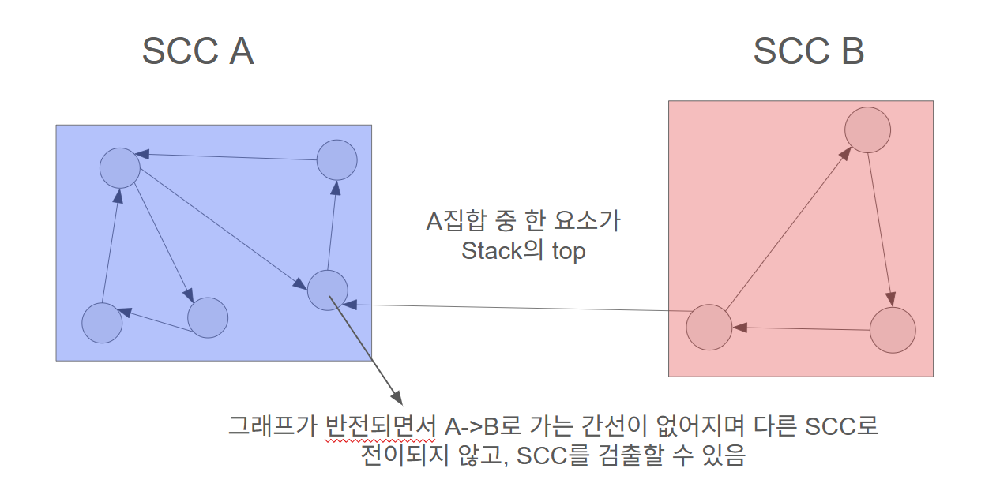

import Caption from '../../../../components/Caption.tsx';

SCC(Strongly Connected Component) - 유향 그래프에서 모든 정점이 다른 모든 정점에 도달할 수 있는 경우, 해당 그래프는 강하게 결합(Strongly Connected)되었다고 정의한다. SCC는 유향 그래프에서 강하게 결합된 요소들을 찾는 문제로 제법 실용적인 용례가 있는 알고리즘. 아래와 같은 상황에서 실제 활용이 가능하다.


- Dependency 문제 : 패키지 매니저, 빌드 시스템 등 의존성이 있는 요소들의 집합을 추출.
- Control-flow Graph : 루프 검출, 강연결 요소끼리의 압축으로 단순화.
- 그 외 2-SAT등 다른 알고리즘의 베이스로 사용되는 등...




<Caption text="3개의 SCC집합으로 이루어진 유향 그래프" />

무향 그래프의 경우 연결만 되어 있다면 모든 정점이 다른 모든 정점으로 가는 것이 가능하기 때문에 특별히 의미가 없다.
유향 그래프에서 SCC집합이 어떻게 형성되는지 탐색하는 알고리즘은 대표적으로 2가지가 있다.

### Tarjan’s algorithm

아래와 같은 방식으로 동작한다.

- 시작 노드를 잡고 DFS기반으로 탐색, 탐색 시 노드에 고유 번호를 부여하면서 노드를 Stack에 쌓는다.
- 탐색한 적 없는 노드인 경우 현재의 고유 번호와 DFS를 통해 검출된 가장 작은 고유 번호 중 작은 쪽으로 병합(기준에 따라서)
- 방문한 적은 있지만 탐색이 종료된 노드(이미 SCC에 포함된 노드)인 경우 무시, 아닌 경우 고유 번호가 작은 쪽으로 부모 노드를 병합한다.
- 사이클이 검출되면(현재 노드의 부모 노드가 고유 번호와 같다면) Stack의 top이 현재 노드와 같을 때까지 노드를 pop하면 하나의 SCC가 검출, pop하면서 탐색 종료 처리한다.
- 탐색 이후 Stack에 남은 요소들은 하나씩 pop하여 단일한 요소를 가진 SCC로 정의한다.

DFS를 1회 수행하면서, 간선을 한 번씩 확인하며 갱신하므로 O(V + E)의 시간 복잡도를 가진다.

```cpp
// Tarjan's algorithm
#include <bits/stdc++.h>
using namespace std;

static int id = 0;

int dfs(vector<vector<int>>& graph, vector<vector<int>>& SCC, vector<int>& uid, vector<int>& finished, stack<int>& st, int cur) {
    uid[cur] = ++id;
    st.push(cur);

    int parent = uid[cur];
    for (int next : graph[cur])
    {
        if (uid[next] == 0) parent = min(parent, dfs(graph, SCC, uid, finished, st, next));
        else if (!finished[next]) parent = min(parent, uid[next]);
    }

    if (parent == uid[cur]) {
        vector<int> scc;
        while (1)
        {
            int top = st.top(); st.pop();
            scc.push_back(top);
            finished[top] = true;
            if (top == cur) break;
        }
        SCC.push_back(scc);
    }
    return parent;
};

int main() {
    ios_base::sync_with_stdio(false); cin.tie(NULL);
    int V, E; cin >> V >> E;
    vector<vector<int>> graph(V + 1);
    vector<vector<int>> SCC;
    vector<int> uid(V + 1, 0);
    vector<int> finished(V + 1, 0);
    stack<int> st;
    for (int i = 0; i < E; i++)
    {
        int u, v; cin >> u >> v;
        graph[u].emplace_back(v);
    }

    for (int i = 1; i < V + 1; i++)
    {
        if (uid[i] != 0) continue;
        dfs(graph, SCC, uid, finished, st, i);
    }

    for (int i = 0; i < SCC.size(); i++) sort(SCC[i].begin(), SCC[i].end());
    sort(SCC.begin(), SCC.end(), [](const auto& a, const auto& b) {return a[0] < b[0]; });
    
    cout << SCC.size() << '\n';
    for (int i = 0; i < SCC.size(); i++)
    {
        for (int j = 0; j < SCC[i].size(); ++j) {
            cout << SCC[i][j] << ' ';
        }
        cout << -1 << '\n';
    }
    return 0;
}

```
<br/>
### Kosaraju’s algorithm

유향 그래프의 간선 방향을 반전시킨 그래프가 SCC집합을 그대로 유지함을 이용하는 방식으로 다음과 같이 동작한다.

- 시작점을 잡고, DFS로 정방향 그래프를 순회하며 마지막에 탐색된 정점부터 Stack에 push한다.
- 반전된 그래프를 Stack top에서 하나씩 노드를 꺼내면서 DFS로 순회, 사이클 검출 시 SCC 집합에 추가한다.
- 모든 정점이 pop 될 때까지 반복한다.


위와 같은 유향 그래프가 있다고 하면


이런 식으로 SCC집합을 압축하여 DAG 형태로 나타낼 수 있다. 첫 번째 DFS를 수행하면서 각 정점이 DFS에서 완전히 처리된 순서의 역순으로 스택에 쌓인다. 이 때 어떤 노드를 시작점으로 잡더라도, 최종적으로 스택의 마지막에 쌓이는 노드는 SCC집합 A에 속한 노드임을 알 수 있다(A의 어떤 점을 선택하더라도 B로 전이되고, 선택한 점이 가장 top으로 가게 된다). Stack에는 탐색 종료 시간에 대해 내림차순으로 노드가 들어가게 되며 이를 위상적인 정렬 순서로 활용할 수 있다.


반전된 그래프에서 SCC는 내부에서 전이 관계를 유지하고, 압축된 DAG에서 SCC집합 간 이동에 관계있는 간선이 반전된다. 첫 번째 DFS에서 얻은 Stack은 원래 그래프에서 SCC를 압축한 DAG의 위상 순서를 반전시킨 것에 해당한다. 이 순서대로 반전된 그래프에서 DFS를 시작하면, 반전된 DAG에서 들어오는 간선이 없는 SCC(여기서는 A)부터 탐색하게 되고, 각각의 DFS가 정확히 하나의 SCC를 검출한다.

2회의 DFS를 수행하면서, 간선을 한 번씩 확인하므로 O(2V + 2E) = O(V + E)의 시간 복잡도를 가진다. 

```cpp
// Kosaraju's algorithm
#include <bits/stdc++.h>
using namespace std;

void dfs(const vector<vector<int>>& graph, vector<int>& visited, stack<int>& st, int cur) {
    visited[cur] = 1;
    for (int next : graph[cur]) {
        if (!visited[next]) dfs(graph, visited, st, next);
    }
    st.push(cur);
}

void reversedDfs(const vector<vector<int>>& graph, vector<int>& visited, vector<int>& SCC, int cur) {
    visited[cur] = 1;
    SCC.push_back(cur);
    for (int next : graph[cur]) {
        if (!visited[next]) reversedDfs(graph, visited, SCC, next);
    }
}

int main() {
    ios_base::sync_with_stdio(false); cin.tie(NULL);
    int V, E; cin >> V >> E;
    vector<vector<int>> graph(V + 1);
    vector<vector<int>> reversedGraph(V + 1);
    vector<vector<int>> SCC;
    vector<int> visited(V + 1, 0);
    stack<int> st;
    for (int i = 0; i < E; i++)
    {
        int u, v; cin >> u >> v;
        graph[u].emplace_back(v);
        reversedGraph[v].emplace_back(u);
    }
    for (int i = 1; i < V + 1; i++)
    {
        if (visited[i] != 0) continue;
        dfs(graph, visited, st, i);
    }

    for (int i = 0; i < V + 1; ++i) visited[i] = 0;
    while (!st.empty())
    {
        int top = st.top(); st.pop();
        if (!visited[top]) {
            vector<int> scc;
            reversedDfs(reversedGraph, visited, scc, top);
            SCC.push_back(scc);
        }
    }

    for (int i = 0; i < SCC.size(); i++) sort(SCC[i].begin(), SCC[i].end());
    sort(SCC.begin(), SCC.end(), [](const auto& a, const auto& b) {return a[0] < b[0]; });
    
    cout << SCC.size() << '\n';
    for (int i = 0; i < SCC.size(); i++)
    {
        for (int j = 0; j < SCC[i].size(); ++j) {
            cout << SCC[i][j] << ' ';
        }
        cout << -1 << '\n';
    }
    return 0;
}

```
<br/>
### References

- [SCC - Wikipedia](https://en.wikipedia.org/wiki/Strongly_connected_component) - https://en.wikipedia.org/wiki/Strongly_connected_component
- [Kosaraju's algorithm - HeadEasy](https://www.youtube.com/watch?v=QlGuaHT1lzA) - https://www.youtube.com/watch?v=QlGuaHT1lzA
- [Tarjan's algorithm - 동빈나](https://www.youtube.com/watch?v=H_Cg3-rv7RU&t=512s) - https://www.youtube.com/watch?v=H_Cg3-rv7RU&t=512s