import Caption from '../../../../components/Caption.tsx';

### **Shadow mapping**

렌더링될 픽셀이 광원 시점에서 visible한지 여부를 통해 그림자를 구현하는 방식. 즉 광원 시점에서의 Depth texture와 z-buffer를 통해 판단한다.
광원 시점에서 장면을 렌더링하고 깊이값을 저장(Shadow map) 한 후 관찰자 시점에서 각 픽셀을 만들어진 shadow map과 비교하며 렌더링에 반영한다.
Shadow volume보다 정확도가 떨어지지만 비교적 속도가 빨라 실시간 렌더링에 사용되는 경우가 많다. 
Shadow map의 해상도에 의해 정확도가 결정되며, 크게 아래의 2가지 과정으로 그림자를 구현한다.

1. Shadow map의 생성  
   - 광원의 종류에 따른 map처리, 깊이 버퍼를 추출하여 저장한다.  
   - 광원이나 장면 내 오브젝트 변화가 있을 경우 업데이트가 필요하다. 카메라만 이동하는 경우에는 Shadow map의 재사용이 가능하다.

2. Shadow map을 적용한 장면의 렌더  
   - 오브젝트를 World space에서 광원 시점의 광원 공간 좌표로 변환  
   - 광원 공간 좌표를 찾고 깊이 테스트 수행, z값이 깊이 맵 값보다 크다면 그림자 영역, x,y 가 광원 공간 좌표 바깥이라면(Shadow map 바깥 영역) 프로젝트의 기준에 따라 결정.  
   - 이 과정에서 그림자 경계 근처라면 Soft-edge처리를 하는 등의 부가 처리가 요구될 수 있다.

그림자 맵의 크기 및 깊이가 그림자의 품질을 결정하는 것으로 인해 그림자는 다른 요소에 비해 artifact를 많이 발생시킨다.
(Alising, bias, peter-panning 등) Soft-edge를 구현하기 위한 알고리즘 예시로 PCF(Percentage Closer Filtering), Smoothies, VSM(Variance Shadow Maps) 등이 존재한다.

#### **World space to Light perspective coordinate transform**

아래의 과정을 통해 변환할 수 있다.

- 광원의 종류에 따른 변환 행렬을 구한다.(LightViewMatrix)  
- 광원의 종류에 따른 투영 변환을 구한다. (LightProjectionMatrix)  
- NDC -> Texture UV 정규화

OpenGL Example
```glsl
vec4 lightClipPos = LightProjectionMatrix * LightViewMatrix * worldPos;
vec3 lightNDC = lightClipPos.xyz / lightClipPos.w; // 원근 분할
vec2 shadowUV = lightNDC.xy * 0.5 + 0.5; // [0,1] 범위 변환
```
<br/>
Directional light의 경우 LookAt으로 Viewmatrix를 구하고 Orthographic으로 투영하는 것이 일반적인 방식이다.
무한히 먼 거리에서 오는 광원의 개념이기 때문에, 광원 자체의 위치는 중요하지 않고 방향만 유의미하며 광선의 방향도 모두 평행한 것을 가정하는게 일반적이기 때문이다.

OpenGL Example
```glsl
glm::vec3 lightDir = glm::normalize(glm::vec3(-0.5f, -1.0f, -0.3f));
glm::vec3 lightPos = cameraPos + lightDir * 50.0f; 
glm::mat4 lightView = glm::lookAt(
    lightPos,                 // 광원 위치
    cameraPos,                // 타겟 위치
    glm::vec3(0.0f, 1.0f, 0.0f) // 업 벡터
);

…

glm::vec3 min = frustumCorners[0], max = frustumCorners[0];
for (const auto& corner : frustumCorners) {
    min = glm::min(min, glm::vec3(corner));
    max = glm::max(max, glm::vec3(corner));
}

// Orthographic 투영 행렬 생성
glm::mat4 lightProj = glm::ortho(
    min.x, max.x,   // X축 범위
    min.y, max.y,   // Y축 범위
    -max.z, -min.z  // Z축 범위 (광원 방향 고려)
);

```
Point light의 경우 전방향에 대한 그림자를 구현하기 위해 보통 Cube map을 사용한다.
Viewmatrix을 구할 때 각 면에 대해 별도 Viewmatrix를 구하고, 투영 시 perspective로 투영한다.

OpenGL Example
```glsl
glm::vec3 lightPos(5.0f, 10.0f, 5.0f);
std::vector<glm::mat4> shadowTransforms = {
    glm::lookAt(lightPos, lightPos + glm::vec3(1,0,0), glm::vec3(0,-1,0)),
    glm::lookAt(lightPos, lightPos + glm::vec3(-1,0,0), glm::vec3(0,-1,0)),
    glm::lookAt(lightPos, lightPos + glm::vec3(0,1,0), glm::vec3(0,0,1)),
    glm::lookAt(lightPos, lightPos + glm::vec3(0,-1,0), glm::vec3(0,0,-1)),
    glm::lookAt(lightPos, lightPos + glm::vec3(0,0,1), glm::vec3(0,-1,0)),
    glm::lookAt(lightPos, lightPos + glm::vec3(0,0,-1), glm::vec3(0,-1,0))
};

glm::mat4 lightProj = glm::perspective(
    glm::radians(90.0f), // FOV
    1.0f,                // Aspect ratio
    0.1f,                // 근거리 평면
    100.0f               // 원거리 평면
);
```
<br/>
### **Shadow artifacts**

Shadow Mapping방식의 그림자는 Depth texture해상도에 의존하는 특성으로부터 발생하는 효과들이 여러가지 존재한다.

#### **Shadow acne**

연속된 3D 장면을 텍셀로 저장하는 과정에서 실제 장면의 표면 깊이와 텍셀 저장 깊이의 미세한 차이로 인해 moire 패턴과 유사한 무늬가 생기는 현상

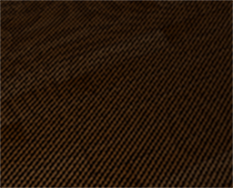
<Caption text="acne 현상이 발생한 모습"/>
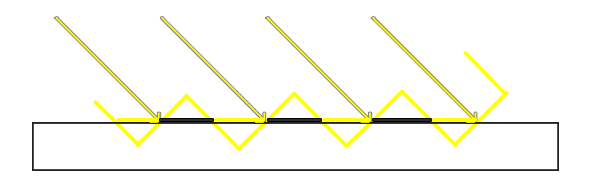
<Caption text="광원 시점의 깊이 샘플 시각화 - 검은 부분이 표면 z값이 텍스처의 z값보다 큰 부분"/>

이러한 현상은 표면과 광원 각도가 작아질 때 더욱 커짐을 예상할 수 있다. Acne현상을 해결하기 위해 Depth bias개념을 사용한다.

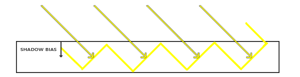
위와 같이 추가적인 offset(shadow bias)를 주어 실제 표면이 더 낮은 것 처럼 만들어 artifact를 완화할 수 있다. 고정값으로 bias를 주거나 cos값에 비례하여 bias를 크게주는 Slope-scaled bias방식이 존재한다.
```glsl
// Slope-scaled bias
float bias = max(0.05 * (1.0 - dot(normal, lightDir)), 0.005);  
```
다만 Shadow bias는 오브젝트의 표면을 실제 표면보다 낮은 것처럼 가정하는 특성으로 인해 또 다른 artifact를 만들 수 있다.

#### **Peter-panning**  
Shadow bias로 인해 실제 바닥표면은 더 아래에 있는 것처럼 취급되므로 물체와 표면 사이의 거리가 있는 것과 같이 그림자가 물체와 분리되어 보이게 된다. 아래는 그 예시 이미지이다.
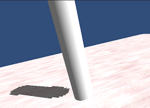
<br/>
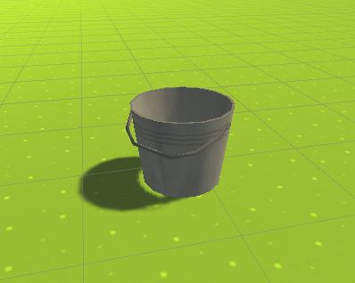

peter-panning을 완화하기 위한 방법의 하나로는 Shadow map을 생성할 때 물체의 Front-face를 Culling하는 방법이 있다.

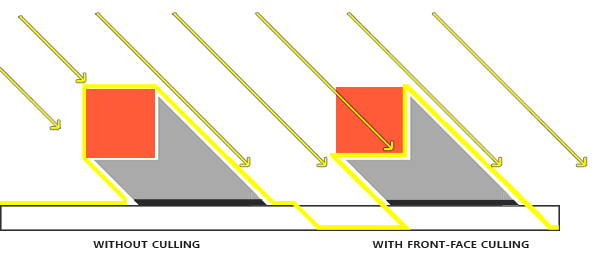
위 방법은 아래와 같은 한계가 있다.

- 어느정도 두꺼운 표면이어야 한다.  t \> bias\_max/cosθ\_max 보장되어야 함  
- 단일 면 객체(Backface가 없는 경우)에 사용 불가
<br/>

### **Shadow oversampling**

Shadow map의 해상도를 상대적으로 높여 aliasing을 감소시키는 기법의 통칭. Shadow map의 특성으로 인해 아무 처리도 하지 않는다면 아래와 같이 aliasing이 발생한다. (해상도가 낮을수록 aliasing증가)
이러한 경계를 부드럽게 표현하기 위해 여러 기법들을 사용한다.
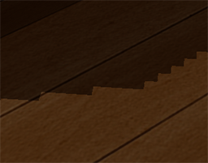


#### **PCF(Percentage Closer Filtering)**

주변 텍셀을 고려하여 영향을 합산하는 방식의 샘플링, 3x3, 5x5등 임의의 주변 텍셀을 추가로 샘플림하여 계산 비용이 더 들지만 보다 자연스러운 그림자를 적용할 수 있다.

OpenGL Example of 3x3 Simple PCF
```glsl
float shadow = 0.0;
vec2 texelSize = 1.0 / textureSize(shadowMap, 0);
for(int x = -1; x <= 1; ++x)
{
    for(int y = -1; y <= 1; ++y)
    {
        float pcfDepth = texture(shadowMap, projCoords.xy + vec2(x, y) * texelSize).r; 
        shadow += currentDepth - bias > pcfDepth ? 1.0 : 0.0;        
    }    
}
shadow /= 9.0;

```
<br/>
PCF는 그림자 품질 향상에 대한 간단한 해결방법의 하나지만 아래와 같은 문제점들이 있다.

1. 성능 문제  
   - 대규모 샘플링 필요: 4x4 이상 필터링 시 GPU 부하가 늘어난다.
   - 밉맵 활용 불가: 일반적 밉맵은 텍셀 값 자체를 선형 결합하여 평균을 뽑는 연산이지만, PCF의 경우 텍셀과 현재 깊이의 비교 연산 값을 결합하기 때문에 결과가 다름. 이로인한 하드웨어 가속 필터링 제한  
   - 동적 필터 크기: 반음영 범위에 따른 비선형 계산 비용

2. 기하학적 한계  
   - 평행 폴리곤 처리: 광원과 평행한 표면에서 깊이 범위 확대
   - 이방성 필터링: 낮은 각도에서의 과도한 텍셀 커버리지
<br/>
#### **VSM(Variance Shadow Map)**

PCF가 Step function으로 이루어져 선형 필터링이 불가능한 점을 개선하기 위해, Shadow map의 깊이를 직접 비교하는 대신, 각 텍셀에 깊이 값의 1·2차 모멘트(평균과 분산)을 저장해,
이 값을 선형 필터링(밉맵, bilinear 등)으로 부드럽게 보간할 수 있도록 만든 기법이다.
그런 다음 Chebyshev’s inequality를 이용해 표면의 깊이보다 앞에 occluder가 있을 확률을 추정함으로써, 많은 PCF 샘플을 구하지 않고도 soft shadow를 근사하고 다중 샘플링 비용을 완화할 수 있다.

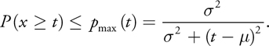
```glsl
float ChebyshevUpperBound(float2 Moments, float t)
{
  // One-tailed inequality valid if t > Moments.x
  float p = (t < = Moments.x);
  // Compute variance.
  float Variance = Moments.y - (Moments.x * Moments.x);
  Variance = max(Variance, g_MinVariance);
  // Compute probabilistic upper bound.
  float d = t - Moments.x;
  float p_max = Variance / (Variance + d * d);
  return max(p, p_max);
}
float ShadowContribution(float2 LightTexCoord, float DistanceToLight)
{
  // Read the moments from the variance shadow map.
  float2 Moments = texShadow.Sample(ShadowSampler, LightTexCoord).xy;
  // Compute the Chebyshev upper bound.
  return ChebyshevUpperBound(Moments, DistanceToLight);
}

```
<br/>
Moments -> x, y 값은 각각 평균과 분산, 즉 평균과 분산으로 이루어진 텍스처를 사용하고 있다. Biasing에 대해서도 옆 픽셀과의 편미분을 통해 효율적으로 처리가 가능하다.

다만 VSM의 경우 확률에 기반하여 그림자 영역을 선형적으로 판단하는 것으로 부터 빛이 들어오지 않아야 할 영역에 희미하게 빛이 들어오는 Light Bleeding현상이 발생할 수 있다.
<br/>
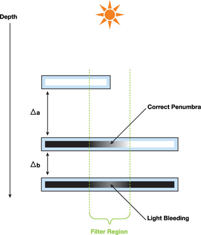

위 이미지처럼 Occluder가 여러 개 섞인 구간에서 체비셰프 부등식의 상계가 느슨해서 가려졌을 확률을 과대평가하기 때문에 발생한다.
VSM에서 나타나는 Light Bleeding현상을 보정하기 위해 Pmax가 일정 값이하로 떨어진다면 0으로 강제 클램핑하는 등 임의의 역치 값을 추가할 수 있다.
이 경우 반음영 영역에서 보다 어둡게 표현되지만 정확도는 향상된다.  


#### **Summed-Area Table**

평균과 분산 계산을 빠르게 하기 위한 최적화 방식의 한 종류, 2차원 구간 합을 빠르게 구하는 알고리즘.

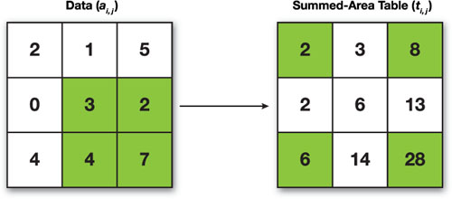

위와 같이 왼쪽 위부터 각 좌표까지의 수를 누적하면서 데이터 테이블을 정의하면 아래 식을 통해서 특정한 두 좌표 (i, j) 부터 (i', j') 까지의 구간합을 구할 수 있고,
이를 그리드 수로 나누어 평균값도 상수시간에 구할 수 있다.

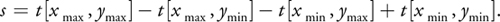

SAT생성 전에 \-0.5를 추가하고 나중에 0.5을 더해주는 것을 통해 추가적인 정밀도 향상을 노릴 수 있다.(부호 비트 활용을 통한 정밀도 향상)

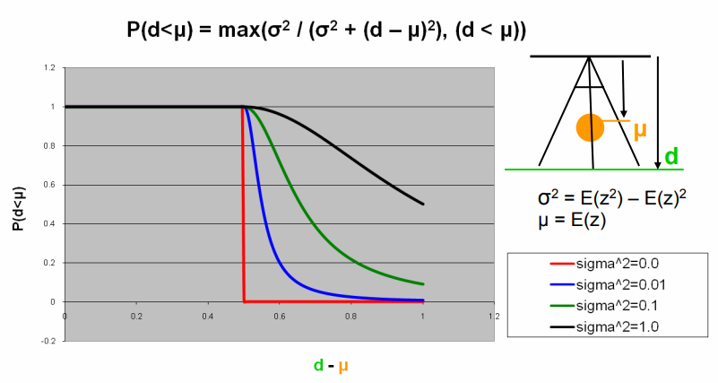
<Caption text="VSM visibility function by sigma - 분산이 작을수록 Step function에 가까워져 Hard shadow형태로 나타난다"/>

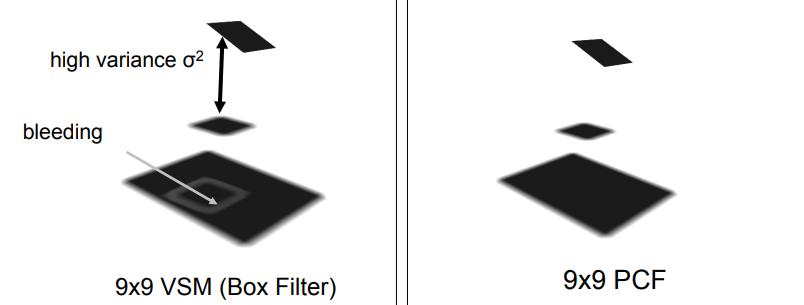

<Caption text="9x9 VSM과 9x9 PCF 방식의 비교"/>
<br/>
#### **Convolution Shadow Map**

1D Fourier Expansion을 사용하여 shadow step function을 근사하는 방식의 shadow map. 고차 푸리에 계수를 사용 시 shadow quality가 향상되고 계산 시간이 늘어나는 trade-off가 존재한다.

#### **Exponentail Shadow Map**

지수 함수를 기반으로 깊이를 왜곡하여 선형 필터링 가능한 형태로 변환하는 방식의 shadow map. Light bleeding현상이 비교적 적으나 광원과 표면의 각도가 적을 때 정밀도 문제가 발생할 수 있다.

<br/>
#### **PSM(Perspective Shadow Map)**

동적 scene에서의 그림자 앨리어싱 문제를 보완하기 위해 탄생한 기법의 하나로, 크게 아래의 두 가지 문제에 대한 보완을 주 목적으로 함

1. 원근 앨리어싱(Perspective Aliasing)  
   - Uniform texel distribution → texel density ∝ 1 / z^2  
   - View space에서 Screen space 원근 투영 시 오브젝트의 크기는 1/z로 축소되므로 스크린에서의 투영 면적은 길이비의 제곱인 1/z^2으로 축소되기 때문이다.
   - 이에 따라 텍셀 밀도가 거리에 따라 불균일하게 분포하여 비효율적으로 자원이 사용되는 문제가 있다.  
2. 광원 위치 제약  
   - 광원이 카메라 뒤에 위치할 때 가상 카메라 기법 필요 → 그림자 품질이 불안정해진다.

기본 아이디어는 그림자 맵을 원근 투영을 활용하여 깊이를 카메라로 부터의 거리에 따라 재분배하여 근거리에는 더 많은 해상도, 원거리에는 적은 해상도를 할당하는 것이다.

원근 투영 행렬은 기본적으로 원근 왜곡된 공간으로 변환하여 근접한 객체는 확대되고 먼 객체는 축소된다, 이러한 특성을 활용하여 아래의 방식을 적용한다.

- 장면을 먼저 사후 투영 공간으로 매핑.  
- 변환된 광원에서 단위 큐브로의 뷰를 렌더링하여 표준 섀도우 맵을 생성.  
- 사후 투영 공간에서는 광원이 장면을 원근 투영된 상태로 보기 때문에, 원근 앨리어싱(perspective aliasing)이 크게 감소되는 효과.

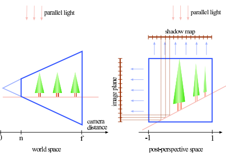
<Caption text="Screen space로 투영되며 근경이 확대, 원경이 축소되며 텍셀 밀도가 불균일해지는 모습"/>

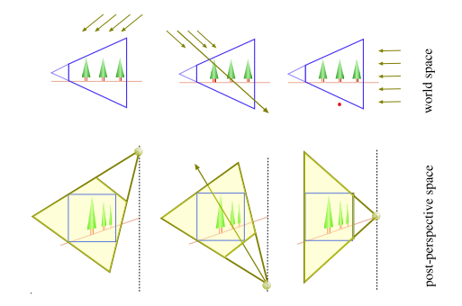
<Caption text="Directional light의 예시"/>
Directional light의 경우 View space에서 방향에 따라 원래 일정한 방향을 향하던 빛이 Screen space에서 모아지거나 벌어지면서 Point light와 유사하게 동작하게 된다.

왼쪽은 원평면->근평면 쪽으로 빛이 들어오며 이 경우 빛의 방향이 퍼진다(근평면으로 올수록 확대되므로)

중앙은 근평명->원평면으로 진행하는 케이스로, 역으로 빛이 모인다(원평면으로 갈수록 축소되므로). 
이 경우 빛이 한 점으로 모이게 되어 정방향에서는 정의할 수 없게되어 역방향에서 오는 빛처럼 처리한다. 이 때 깊이 테스트도 역순으로 진행하여야 한다.

우측은 빛이 원평면->근평면으로 수직하게 들어오는 케이스로 빛이 벌어지며 관찰자 앞에 있는 점 광원 처럼 취급된다.

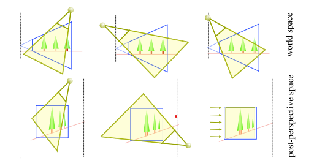
<Caption text="Point light의 예시"/>

방향성 광원과 같이 빛이 모아지거나 벌어지는 작용을 받으나 기본적으로는 Point light의 성질을 유지한다. 방향에 따라 inverted되는 경우가 존재한다(중앙).
우측과 같이 특수한 경우(원래의 광원의 방향이 퍼지는 정도와 원근 투영에 의해 왜곡되는 정도가 유사한 경우) 마치 Directional light처럼 동작하게 된다.

시야 바깥의 오브젝트가 그림자를 드리우는 것에 대한 문제점

- 원근 투영의 특성으로 원근 frustum 뒷편의 물체의 카메라 평면를 가로지를 때 음의 무한 평면에 매핑  
- 이러한 특성으로 인해 그림자가 뒤집혀 보일 수 있음.  
- 이 문제의 해결을 위해 가상 카메라 개념을 도입한다.

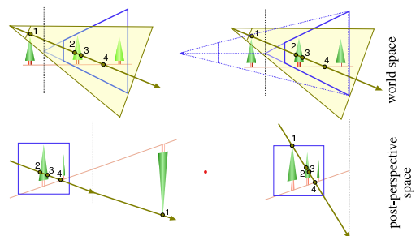

가상 카메라를 오브젝트가 모두 포괄될 수 있는 위치로 설정하여 음의 무한 평면에 매핑되는 문제를 완화한다. 
다만 너무 먼거리로 설정 시 다시 근거리에 충분한 해상도를 분배하지 못하는 문제가 발생하여 앨리어싱이 발생할 수 있기 때문에 적절한 거리를 찾아야 한다.
무한 거리에 가상 카메라를 두는 경우 균일 그림자 맵과 동일한 상태가 된다.


#### **PSSM(Parallel-Split Shadow Map) = CSM(Cascading Shadow Map)**

같은 계열의 Shadow map방식, PSSM이 보다 보편적인 표현이다. View frustum을 뷰 평면과 평행한 여러 평면으로 나누어 깊이 계층을 두고,
각 깊이 계층마다 독립적인 Shadow map를 생성하는 방식을 의미한다. 광범위한 장면에서의 perspective aliasing을 감소시키기 위한 방식으로,
관찰자로부터의 거리에 따른 샘플링 밀도 조정에 의의를 가진다.  

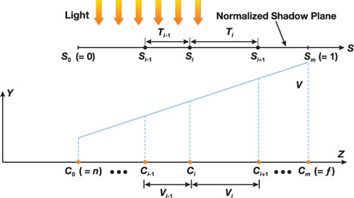
<Caption text="PSSM 방식의 도식화"/>

계층별로 별도 map을 쓰는 특성으로 인해 전통적인 Shadow map방식에 비해 넓은 범위의 장면에 효율적으로 shadow를 적용하는 것이 가능하다. 
계층간 구분점이 되는 부분에서의 처리를 신경써 주어야 한다.
분할 계층을 늘리면 shadow map생성 수, 렌더링 패스 수가 증가 하는 대신 앨리어싱의 영향이 감소한다. (Trade-off)

##### **View frustum 분할 방식**

PSSM방식을 사용하기 위해 적절한 단위로 View frustum을 분할해야 한다. 균등한 깊이로 분할 시 근평면에서 under-sampling, 로그 분할 시 근평면에서 over-sampling되어 각각 오차가 커진다.
일반적으로 균등분할과 로그 분할의 가중치 합을 기준으로 분할하는 Practical split scheme 사용하여 어느정도 일정한 샘플링 밀도를 유지한다.  

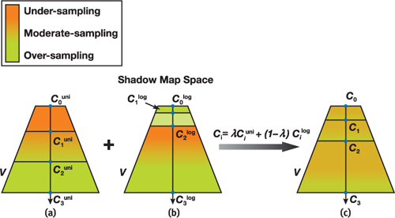
<Caption text="(a) uniform-sampling (b) log-sampling (c) practical split scheme"/>

PSSM방식에서는 분할된 Frustum 깊이 계층의 shadow map 해상도를 극대화 하기 위해 크롭 행렬을 추가로 구하여 곱해주는 작업이 포함된다.

- 광원 프로젝션이 장면 전체를 포괄하기에 분할 frustum에 밀착시켜 텍셀 활용도를 높일 필요가 있음  
- 크롭 행렬을 통해 광원 frustum(AABB)를 분할계층에 밀착시켜 zoom-in 효과를 만듦  
- 이를 통해 텍셀 밀도를 균일화하고 근/원평면을 조정하여 깊이 버퍼의 유효 비트 활용도를 증가시킨다.

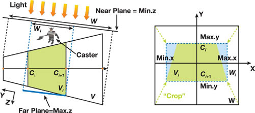
<Caption text="shadow map의 frustum crop"/>
광원 frustum을 밀착 시키는 과정의 이미지

아래와 같은 과정을 통해 Crop matrix를 구할 수 있다.분할 frustum을 AABB로 변환하여 이로부터 구하도록 함
```glsl
Light::CalculateCropMatrix(Frustum splitFrustum)
{
  Matrix lightViewProjMatrix = viewMatrix * projMatrix;
  // Find boundaries in light's clip space
  BoundingBox cropBB = CreateAABB(splitFrustum.AABB, lightViewProjMatrix);
  // Use default near-plane value
  cropBB.min.z = 0.0f;
  // Create the crop matrix
  float scaleX, scaleY, scaleZ;
  float offsetX, offsetY, offsetZ;
  scaleX = 2.0f / (cropBB.max.x - cropBB.min.x);
  scaleY = 2.0f / (cropBB.max.y - cropBB.min.y);
  offsetX = -0.5f * (cropBB.max.x + cropBB.min.x) * scaleX;
  offsetY = -0.5f * (cropBB.max.y + cropBB.min.y) * scaleY;
  scaleZ = 1.0f / (cropBB.max.z - cropBB.min.z);
  offsetZ = -cropBB.min.z * scaleZ;
  return Matrix(scaleX, 0.0f, 0.0f, 0.0f, 0.0f, scaleY, 0.0f, 0.0f, 0.0f, 0.0f,
                scaleZ, 0.0f, offsetX, offsetY, offsetZ, 1.0f);
}
```
<br/>
Crop matrix를 구하여 최종적으로 shadow map을 구할 때 아래와 같이 추가로 곱하여 준다.
```glsl
lightViewMatrix * lightProjMatrix * cropMatrix
```
<br/>
##### **Scene dependant projection**

위 Crop matrix방식과 유사하지만 그림자를 드리우는 Caster object와 영향을 받는 Receiver object를 고려하여 도출하는 방식. 각각의 오브젝트 그룹의 AABB를 병합하여 통합 계산한다.
```glsl
for (int i = 0; i < casters.size(); i++)
  {
    BoundingBox bb = CreateAABB(casters[i]->AABB, lightViewProjMatrix);
    casterBB.Union(bb);
  }
 
// Merge all bounding boxes of receivers into a bigger "receiverBB".
for (int i = 0; i < receivers.size(); i++)
{
  bb = CreateAABB(receivers[i]->AABB, lightViewProjMatrix);
  receiverBB.Union(bb);
}


splitBB = CreateAABB(splitFrustum.AABB, lightViewProjMatrix);
// Scene-dependent bounding volume
BoundingBox cropBB;
cropBB.min.x = Max(Max(casterBB.min.x, receiverBB.min.x),splitBB.min.x);
cropBB.max.x = Min(Min(casterBB.max.x, receiverBB.max.x),splitBB.max.x);

… 

```
세부 구현 사항은 원문으로부터

**Nvidia GPU Gems3 chapter 10**  
[https://developer.nvidia.com/gpugems/gpugems3/part-ii-light-and-shadows/chapter-10-parallel-split-shadow-maps-programmable-gpus\#:\~:text=In%20this%20chapter%20we%20present%20an%20advanced%20shadow-mapping,details%20of%20our%20technique%20on%20modern%20programmable%20GPUs](https://developer.nvidia.com/gpugems/gpugems3/part-ii-light-and-shadows/chapter-10-parallel-split-shadow-maps-programmable-gpus#:~:text=In%20this%20chapter%20we%20present%20an%20advanced%20shadow-mapping,details%20of%20our%20technique%20on%20modern%20programmable%20GPUs).

**Nvidia GPU Gems chapter 14**  
[https://developer.nvidia.com/gpugems/gpugems/part-ii-lighting-and-shadows/chapter-14-perspective-shadow-maps-care-and-feeding](https://developer.nvidia.com/gpugems/gpugems/part-ii-lighting-and-shadows/chapter-14-perspective-shadow-maps-care-and-feeding)

#### **PCSS(Percentage closer soft shadows)**

PCF / VSM / CSM / ESM과 달리 Penumbra(반음영) 이 동적으로 변하는 방식의 shadow 보정 알고리즘이다.
타 방법과 달리 광원을 점이 아닌 면으로 고려하여야 한다(반음영 영역이 생기기 위해서는 너비가 없는 점광원이 아니라 영역이 존재하여야 함) 
기존 섀도우 매핑에 아래의 3가지 단계를 추가하여 soft-shadow를 구현한다.

1. Blocker Search(차단자 탐색)  
   * point sampling을 진행하여 광원과 receiver사이의 occluder평균 깊이 / 반음영 영역의 생성 가능성 계산한다.
2. Penumbra Estimation  
   * Occluder / receiver 깊이 및 광원 영역의 크기를 기반으로 반음영 영역 크기를 추정한다.
3. (Optional) 추정된 크기에 맞추어 PCF / VSM 등 추가 필터링 적용

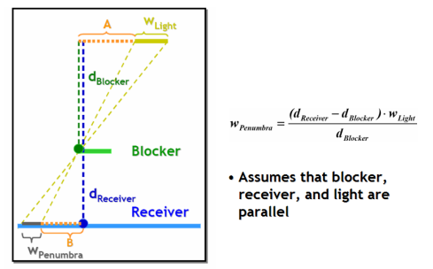
<Caption text="Penumbra Estimation - blocker/receiver와의 거리, 광원 영역을 통해 반그림자 영역을 계산"/>

필터링을 효율적으로 적용하기 위해 SACSM(Summed Area CSM) / MIPCSM(Mipmap CSM)등의 기법을 사용할 수 있다. MIPCSM 방식이 가우시안 블러에 가까운 표현이 가능하여 보다 자연스러운 그림자 표현 가능하다.
### References

[https://www-sop.inria.fr/reves/Basilic/2002/SD02/PerspectiveShadowMaps.pdf](https://www-sop.inria.fr/reves/Basilic/2002/SD02/PerspectiveShadowMaps.pdf)  
[https://developer.download.nvidia.com/shaderlibrary/docs/shadow\_PCSS.pdf](https://developer.download.nvidia.com/shaderlibrary/docs/shadow_PCSS.pdf)  
[https://link.springer.com/chapter/10.1007/978-1-4842-7185-8\_24](https://link.springer.com/chapter/10.1007/978-1-4842-7185-8_24) \- Blue noise  
[https://dev.epicgames.com/documentation/en-us/unreal-engine/lumen-technical-details-in-unreal-engine?application\_version=5.1](https://dev.epicgames.com/documentation/en-us/unreal-engine/lumen-technical-details-in-unreal-engine?application_version=5.1)  
[https://developer.download.nvidia.com/presentations/2008/GDC/GDC08_SoftShadowMapping.pdf](https://developer.download.nvidia.com/presentations/2008/GDC/GDC08_SoftShadowMapping.pdf)  