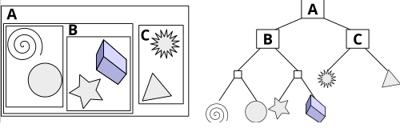
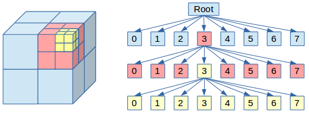
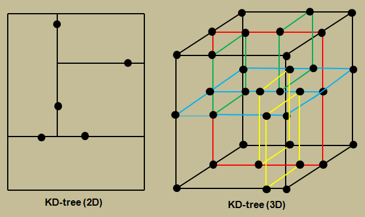

import Caption from '@/components/Caption.tsx';

### **공간 분할 알고리즘, 왜 사용하는가?**

3D 게임에서는 일반적으로 World의 개념이 존재하고 해당 공간 내에 게임을 구성하는 다양한 오브젝트들이 배치된다.(Scene-graph)
개발자는 게임 제작 시 다양한 목적으로 오브젝트의 계층 구조 상에서 특정 오브젝트를 검출하거나, 카운팅을 하는 등의 쿼리가 필요한 경우가 많고
이를 효율적으로 수행할 수 없는 경우 게임의 성능에 문제가 있을 수 있다. 대표적인 필요 케이스는 다음과 같은 것들이 있다.

- 물리 연산 : 충돌 감지의 대상 선택 등
- 레이트레이싱 : Ray의 영향을 받을 삼각형 선택
- 렌더링 : Culling 대상의 선택 등

오브젝트간의 상호 작용을 단순하게 아래와 같이 모든 오브젝트에 대해 검사를 수행하는 경우 O(N), O(N^2)의 복잡도로 수행되어 오브젝트의 수가 많은 프로젝트의 경우 문제가 발생할 수 있다.
```cpp
// 특정 속성의 오브젝트 검출 pseudo code
for (Object : Object Pool) {
    check(Object)
}

// 오브젝트 쌍 검출의 pseudo code
for (Object1 : Object Pool) {
    for (Object2 : Object Pool) {
        check(Object1, Object2)
    }    
}
```

공간 분할 알고리즘의 공통적인 목표는 이러한 동작의 효율을 높이는 것이다.
대체로 Log scale로 탐색 시간을 줄이는 경우가 많고, 방법에 따라 유리한 상황이 다르므로 적용할 상황에 따라 적절한 알고리즘을 사용하여야 한다.
<br/>
#### **BVH (Bounding Volume Hierarchy)**
Scene-graph에 속한 객체들을 특정한 기준에 따라 바운딩 볼륨(AABB, OBB 등)으로 감싸 트리로 표현하는 구조,
각각의 바운딩 볼륨은 더 큰 바운딩 볼륨에 완전히 포함된다. 트리의 가장 위에는 단일한 바운딩 볼륨이 있고, 리프노드는 프로젝트에 따라 메쉬/프리미티브 등으로 구성된다.


<Caption text="BVH 도식화 - Wikipedia"/>

충돌 검사 등에서 부모레벨에서 교차하지 않는다면 자식 노드에 해당하는 오브젝트들의 검사를 무시할 수 있다. 따라서 Log-scale로 검사 대상을 좁힐 수 있다. 다만 적절한 성능을 보장하기 위해 아래와 같은 
사항들을 고려하여 자료구조과 로직을 설계하여야 한다.

- 트리의 아래쪽으로 갈수록 노드들은 서로 가까워야 한다. 즉 공간적으로 가까운 오브젝트끼리 묶여야 한다.
- BVH의 각 노드는 최소 볼륨이어야 한다.
- 모든 경계 볼륨의 합은 최소화되어야 한다.
- Pruning시 더 많은 객체가 고려 대상에서 제외되기 때문에, BVH 루트 근처 노드에 더 많은 주의를 기울여야 한다. 
- Sibling node 중복 볼륨이 최소화되어야 한다.
- BVH는 노드 구조와 내용 모두에서 균형을 이루어야 한다.

BVH 구조는 동적인 씬에 비교적 강하다. 어떤 객체가 조금 움직이면, 그 객체가 속한 리프와 위쪽 몇 레벨의 박스만 갱신하면 되므로 갱신 비용이 비교적 저렴하다.
다만, 자식 AABB들이 겹칠 수 있어서, 레이/쿼리가 양쪽 서브트리를 둘 다 타고 내려가야 하는 경우가 생길 수 있다.

```c++
// BVH pseudo code
struct BVHNode {
    AABB bounds
    bool isLeaf
    BVHNode* left
    BVHNode* right
    Primitive[] primitives  // leaf node
}

BVHNode* build(Primitive[] prims) {
    node = new BVHNode()
    node.bounds = computeAABB(prims)

    if prims.size <= LEAF_THRESHOLD:
        node.isLeaf = true
        node.primitives = prims
        return node

    // 적절한 기준에 따라 둘로 나누기 - ex) 가장 긴 축 기준
    axis = longestAxis(node.bounds)
    sort(prims by prim.center[axis])
    mid = prims.size / 2
    leftPrims  = prims[0 : mid]
    rightPrims = prims[mid : end]

    node.isLeaf = false
    node.left  = buildBVH(leftPrims)
    node.right = buildBVH(rightPrims)
    return node
}

bool intersectQuery(BVHNode* node, Ray ray, out Hit hit) {
    if not rayIntersectsAABB(ray, node.bounds):
        return false

    if node.isLeaf:
        hitFound = false
        for prim in node.primitives:
            if rayIntersectsPrimitive(ray, prim, tmpHit):
                if tmpHit.t < hit.t:
                    hit = tmpHit
                    hitFound = true
        return hitFound

    // 재귀적으로 탐색
    hitLeft  = intersectBVH(node.left,  ray, hit)
    hitRight = intersectBVH(node.right, ray, hit)
    return hitLeft or hitRight
}
```
<br/>
#### **Octree**

3D 공간을 축 정렬 큐브로 보고, 각 노드를 8개의 균등한 서브 큐브로 재귀적으로 나누는 8진 트리 형태의 자료구조/알고리즘.
프로젝트에서 World개념에 해당하는 전체를 루트로 보고 공간 자체를 균일하게 나눈다. 2차원 구조라면(2D 게임 등) Quad-tree로 표현된다.
구조가 단순하고 구현이 직관적인 장점이 있다.


<Caption text="Octree 도식화"/>

정해진 공간을 일정한 비율로 나누는 방식으로 인해 아래와 같은 특징이 존재한다.
- 특정 위치를 구하는 문제에 대해 매우 빠르게 동작한다.
- 정적인 공간 분포를 다루는 것에 유리하다.(voxel 데이터, Grid data기반의 전처리 등)
- 비균일 분포에서 비효율적으로 동작한다.
- Cache locality가 안 좋아질 수 있다.(접근 패턴이 불규칙적, 어느 자식 노드로 내려갈 지의 문제)

```cpp
// Octree pseudo code
struct OctreeNode {
    AABB region
    OctreeNode* children[8]
    Object[] objects  // 노드에 들어 있는 객체 목록
    bool isLeaf
}

OctreeNode* createNode(AABB region) {
    node = new OctreeNode()
    node.region = region
    node.isLeaf = true
    return node
}

void insertObject(OctreeNode* node, Object obj, int depth) {
    if not intersects(node.region, obj.bounds):
        return

    if node.isLeaf and (node.objects.size < MAX_PER_NODE or depth >= MAX_DEPTH):
        node.objects.push(obj)
        return
    // 허용 개수를 넘은 경우 분할 후 재분배
    if node.isLeaf:
        subdivide(node) // 8개의 자식 region 생성
        redistribute(node) // 기존 objects를 자식들에게 재분배
        node.isLeaf = false

    for i in 0..7:
        insertObject(node.children[i], obj, depth + 1)
}

void queryRange(OctreeNode* node, AABB range, out Object[] result) {
    if not intersects(node.region, range):
        return

    // 이 노드에 저장된 객체 검사
    for obj in node.objects:
        if intersects(obj.bounds, range):
            result.push(obj)

    // 재귀적으로 검사
    if not node.isLeaf:
        for i in 0..7:
            queryRange(node.children[i], range, result)
}
```
<br/>
#### **K‑d tree(k‑dimensional tree)**

K차원 공간상의 점 또는 프리미티브를 관리하는 이진 트리로, 각 내부 노드는 특정 축(3차원의 경우 x/y/z)을 하나 골라, 그 축의 한 임계값에서 왼쪽/오른쪽의 두 반공간으로 나누는 것을 반복하는 구조를 가진다.
깊이에 따라 축을 x→y→z→x… 순으로 바꾸거나, AABB의 “가장 긴 축”을 택하는 등 다양한 분할 전략이 있다.


<Caption text="2D/3D K-d tree 도식화"/>

축에 대해 공간 분할하는 특성으로 인해 최근접 이웃 검색(Nearest Neighbor), range query등의 문제에 이점이 있다.
예를 들어, 이미 지나온 노드의 경우 서브트리의 바운딩 박스 등을 활용해서 리프에서 잰 최근접 거리보다 큰 영역을 빠르게 결정할 수 있는 등의 구별되는 장점이 있다.

다만 트리의 분할 기준이 전체 데이터 분포에 크게 의존하기 때문에 동적인 환경에서 빌드/업데이트 비용이 크고,
노드 재구성이 무겁다는 단점이 있다. 

```cpp
// K-d tree pseudo code
struct KDNode {
    Point point  // 노드가 가진 포인트
    int axis     // 분할 축 ex) 0 = x, 1 = y
    KDNode* left
    KDNode* right
}

KDNode* buildKDTree(Point[] points, int depth) {
    if points.empty():
        return null

    axis = depth % K // 축을 번갈아가며 교체
    sort(points by coordinate[axis])

    mid = points.size / 2

    node = new KDNode()
    node.point = points[mid]
    node.axis  = axis

    leftPoints  = points[0 : mid]
    rightPoints = points[mid+1 : end]

    node.left  = buildKDTree(leftPoints,  depth + 1)
    node.right = buildKDTree(rightPoints, depth + 1)
    return node
}

// 최근접 이웃 쿼리 pseudo code
struct NNResult {
    Point bestPoint
    float bestDist2
}

void nearestNeighbor(KDNode* node, Point query, inout NNResult res) {
    if node == null:
        return

    axis = node.axis
    float d2 = distanceSquared(query, node.point)
    if d2 < res.bestDist2:
        res.bestDist2 = d2
        res.bestPoint = node.point

    // 어느 쪽 서브트리를 먼저 볼지 결정
    KDNode* first
    KDNode* second
    if query[axis] < node.point[axis]:
        first  = node.left
        second = node.right
    else:
        first  = node.right
        second = node.left

    // 가까운 쪽 서브트리 탐색
    nearestNeighbor(first, query, res)

    // 다른 쪽을 볼 필요가 있는지 체크
    // 분할 평면까지의 거리^2 < 현재 bestDist2 인 경우만 탐색
    float planeDist = query[axis] - node.point[axis]
    if planeDist * planeDist < res.bestDist2:
        nearestNeighbor(second, query, res)
}
```
<br/>
### References
[https://en.wikipedia.org/wiki/K-d_tree](https://en.wikipedia.org/wiki/K-d_tree)  
[https://en.wikipedia.org/wiki/Bounding_volume_hierarchy](https://en.wikipedia.org/wiki/Bounding_volume_hierarchy)  
[https://en.wikipedia.org/wiki/Octree](https://en.wikipedia.org/wiki/Octree)  
[https://geidav.wordpress.com/2014/07/18/advanced-octrees-1-preliminaries-insertion-strategies-and-max-tree-depth/]  